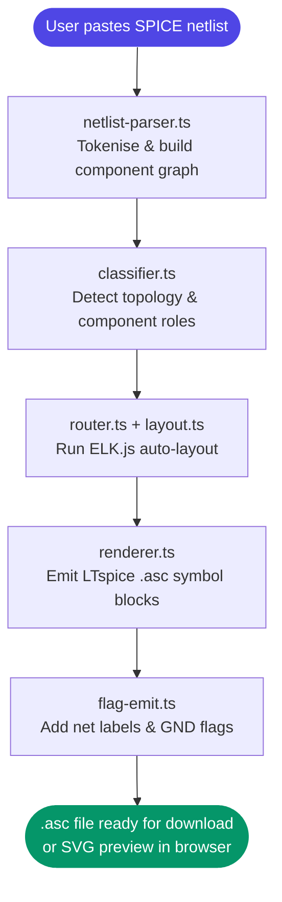
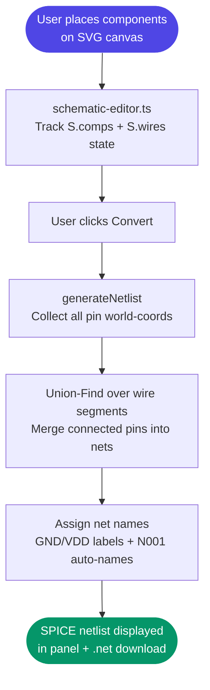

# ⚡ Weave


> **One-liner:** A fully client-side browser tool that converts SPICE netlists to interactive LTspice schematics — and draws schematics that generate netlists back.

---

## 📌 Table of Contents

- [The Problem](#-the-problem)
- [Our Solution & Purpose](#-our-solution--purpose)
- [Why This Over Others](#-why-this-over-others)
- [Tech Stack](#-tech-stack)
- [System Flow](#-system-flow)
- [File Structure](#-file-structure)
- [Prerequisites](#-prerequisites)
- [Installation & Setup](#-installation--setup)
- [Usage](#-usage)
- [Configuration](#-configuration)
- [Screenshots](#-screenshots)
- [Contribution Guidelines](#-contribution-guidelines)
- [Known Limitations & Roadmap](#-known-limitations--roadmap)
- [License](#-license)

---

## 🚨 The Problem

SPICE netlists are text — powerful, but completely opaque to anyone who isn't already familiar with the exact topology. Visualising them requires either expensive EDA software or manual re-drawing. Going the other direction — sketching a schematic and getting a simulation-ready netlist back — is even harder without a full EDA suite installed.

**Key pain points:**
- ⚠️ Existing SPICE-to-schematic converters require desktop installs or proprietary licences
- ⚠️ No browser-native tool lets you draw a schematic and instantly get a valid SPICE netlist
- ⚠️ LTspice `.asc` files are opaque XML-like formats with no readable round-trip path from a plain netlist
- ⚠️ Students and hobbyists have no lightweight, offline-capable tool for quick schematic work

---

## 🎯 Our Solution & Purpose

**Weave** is a browser-based EDA utility that provides a complete, bidirectional SPICE ↔ LTspice schematic workflow — with zero installation, zero server calls, and no data leaving your machine.

It solves the above by:
1. **Netlist → Schematic (Tab 1)** — Paste any SPICE netlist; Weave parses it, classifies topology, runs an ELK.js auto-layout, and renders a downloadable LTspice `.asc` schematic.
2. **Schematic → Netlist (Tab 2)** — Use the interactive SVG canvas to place components, draw wires, rotate and mirror symbols, and click Convert to get a simulation-ready SPICE netlist instantly.
3. **Fully client-side** — Everything runs in the browser. No backend, no accounts, no data leaves your machine.

---

## ⚡ Why This Over Others

| Feature | Weave | KiCad | LTspice | CircuitLab |
|---|:---:|:---:|:---:|:---:|
| Works in the browser | ✅ | ❌ | ❌ | ✅ |
| Zero install / no account | ✅ | ❌ | ❌ | ❌ |
| SPICE netlist → schematic | ✅ | ❌ | ❌ | ❌ |
| Schematic → SPICE netlist | ✅ | ✅ | ✅ | ✅ |
| LTspice `.asc` export | ✅ | ❌ | ✅ | ❌ |
| Full 8-code rotation (R0–MR270) | ✅ | ✅ | ✅ | ❌ |
| Open source | ✅ | ✅ | ❌ | ❌ |
| Offline capable | ✅ | ✅ | ✅ | ❌ |

> 💡 **The bottom line:** Weave is the only open-source, browser-native tool that handles the full round-trip — from raw SPICE text to a rendered, downloadable schematic and back.

---

## 🛠 Tech Stack

### Frontend
| Technology | Version | Purpose |
|---|---|---|
| TypeScript | 5 | All application logic — full static typing across Tab 1 and Tab 2 |
| SVG | — | Interactive schematic canvas with pan, zoom, grid snap, and ghost rendering |
| HTML5 / CSS3 | — | UI layout, tabs, dark theme |

### Build & Dev
| Technology | Version | Purpose |
|---|---|---|
| [Vite](https://vitejs.dev/) | 5 | Dev server with HMR + production bundler |
| TypeScript compiler | 5 | Type checking and transpilation |

### Layout Engine
| Technology | Version | Purpose |
|---|---|---|
| [elkjs](https://github.com/kieler/elkjs) | bundled | Automatic hierarchical graph layout for Tab 1 schematics |

### Parsing & Netlist Generation
| Technology | Version | Purpose |
|---|---|---|
| Custom SPICE parser (`netlist-parser.ts`) | — | Tokenises and models SPICE netlist elements; warns on MOSFET bulk-node collapse |
| Union-Find (DSU) | — | Wire connectivity → net name assignment in Tab 2 |
| Custom `.asc` emitter (`flag-emit.ts`, `renderer.ts`) | — | Produces valid LTspice schematic files |
| Typed error hierarchy | — | `WeaveError` → `ParseError \| SymbolError \| LayoutError \| RoutingError` |
| Configurable logger | — | Single `logger` object with `level` + `onEmit` hook wired to the UI console pane |

---

## 🔄 System Flow

### Tab 1 — Netlist → Schematic



### Tab 2 — Schematic → Netlist



### Flow Explanation

| Step | Description |
|---|---|
| **Parse** | Raw SPICE text → structured component objects with node connections |
| **Classify** | Identify subcircuits, power rails, ground flags, and topology hints |
| **Layout** | ELK.js assigns x/y positions and routing for each component |
| **Render** | Positions → LTspice `.asc` coordinate space with symbol references |
| **Canvas** | User clicks palette buttons, places components at snapped grid positions (16 px) |
| **Union-Find** | Each wire segment is scanned; all pin world-coordinates it passes through are unioned into a single net |
| **Emit** | Net map → SPICE element lines (R/C/L/V/I/D/Q/M/J/B/E/G/F/H/S/W/T/X) |

---

## 📁 File Structure

```
weave/
│
├── index.html                  # Single-page app shell; two-tab layout
├── landing.html                # Marketing landing page
├── vite.config.ts              # Vite build and dev server configuration
├── tsconfig.json               # TypeScript compiler options
├── package.json                # npm scripts and dependency manifest
│
├── css/
│   └── style.css               # Global dark-theme styles
│
├── lib/                        # Third-party libraries (elkjs bundle)
│
├── data/                       # Static reference data (symbol definitions, etc.)
│
├── src/                        # All application source — TypeScript ES modules
│   ├── app.ts                  # Entry point; mounts Tab 1 and Tab 2; wires logger.onEmit to UI console
│   ├── logger.ts               # Configurable logger (level + onEmit hook)
│   ├── errors.ts               # Typed error hierarchy: WeaveError → ParseError | SymbolError | LayoutError | RoutingError
│   ├── asc2net.ts              # .asc → netlist converter — bidirectional utility
│   │
│   ├── tab1/                   # Netlist → Schematic pipeline (Tab 1)
│   │   ├── convert.ts          # Top-level Tab 1 orchestrator
│   │   ├── netlist-parser.ts   # SPICE netlist tokeniser and AST builder
│   │   ├── classifier.ts       # Topology classification (series/parallel/bridge etc.)
│   │   ├── layout.ts           # ELK.js layout wrapper
│   │   ├── router.ts           # Wire routing logic
│   │   ├── route-helpers.ts    # Geometry helpers for routing
│   │   ├── renderer.ts         # LTspice .asc symbol emitter
│   │   ├── flag-emit.ts        # Net flag and GND symbol emitter
│   │   ├── symbols.ts          # LTspice symbol name mapping
│   │   ├── orientation.ts      # Component rotation and depth logic
│   │   ├── net-repair.ts       # Net connectivity repair passes
│   │   ├── place-isolated.ts   # Layout for isolated (unconnected) components
│   │   ├── place-repair.ts     # Post-layout position repair
│   │   ├── safe-modes.ts       # Fallback rendering strategies
│   │   ├── verifier.ts         # Output netlist sanity checks
│   │   └── wire-merge.ts       # Wire segment simplification + junction detection
│   │
│   ├── tab2/                   # Schematic → Netlist pipeline (Tab 2)
│   │   ├── schematic-editor.ts # Full interactive SVG canvas editor + netlist generation
│   │   │                       # Supports all 8 LTspice rotation codes (R0/R90/R180/R270/MR0/MR90/MR180/MR270)
│   │   └── schematic-symbols.ts# Component SVG shapes + pin coordinate definitions
│   │
│   └── shared/                 # Pure geometry utilities — no tab1/tab2 dependencies
│       ├── geometry.ts         # 2D geometry primitives (GRID, snap, rot, rotBBox)
│       └── topology.ts         # Graph connectivity analysis (topology hints)
│
└── tests/                      # Test fixtures and scripts
```

---

## 🧰 Prerequisites

| Requirement | Minimum Version | Check Command | Notes |
|---|---|---|---|
| Node.js | 18+ | `node --version` | Required for Vite dev server and build |
| npm | 9+ | `npm --version` | Bundled with Node.js |
| Any modern browser | Chrome 90+ / Firefox 90+ / Safari 15+ | — | ES Modules + SVG required |
| Git | v2.x | `git --version` | For cloning only |

> ⚠️ **`file://` won't work** — browsers block ES module imports from `file://` origins. Always use the Vite dev server (`npm run dev`).

---

## 🚀 Installation & Setup

### 1. Clone the Repository

```bash
git clone https://github.com/your-username/weave.git
cd weave
```

### 2. Install Dependencies

```bash
npm install
```

### 3. Start the Dev Server

```bash
npm run dev
```

### 4. Open in Browser

```
http://localhost:5173
```

### Production Build (optional)

```bash
npm run build
```

Output goes to `dist/` — serve with any static file host.

---

## 💡 Usage

### Tab 1 — Netlist → Schematic

1. Paste a SPICE netlist into the left panel (or pick one of the built-in examples from the dropdown).
2. Click **Convert**.
3. The schematic renders as an SVG on the right.
4. Click **Download .asc** to save a valid LTspice schematic file.

**Example input:**
```spice
* RC Low-pass filter
V1 in 0 AC 1
R1 in out 1k
C1 out 0 1n
.ac dec 100 1k 1Meg
.end
```

**Expected output:** A routed schematic SVG + downloadable `schematic.asc`.

### Tab 2 — Schematic → Netlist

1. Click a component in the **left palette** (Resistor, Capacitor, NPN BJT, etc.).
2. Click on the canvas to place it. Press **R** to rotate or **M** to mirror before placing.
3. Click **Wire** then click two points to draw a wire segment.
4. Click **Convert** to generate the SPICE netlist.
5. Click **.net** to download it.

### Keyboard Shortcuts (Tab 2)

| Key | Action |
|---|---|
| `R` | Rotate component 90° (works in place mode and select mode) |
| `M` | Mirror component horizontally (works in place mode and select mode) |
| `Escape` | Cancel current action / deselect / return to Select mode |
| `Delete` | Delete selected component |
| `W` | Enter wire-drawing mode |

### LTspice Rotation Codes

Weave fully supports all 8 LTspice rotation codes used in `.asc` files:

| Code | Meaning |
|---|---|
| `R0` | No rotation (default upright) |
| `R90` | Rotated 90° counter-clockwise |
| `R180` | Rotated 180° |
| `R270` | Rotated 270° counter-clockwise |
| `MR0` | Mirrored horizontally, no rotation |
| `MR90` | Mirrored, then rotated 90° |
| `MR180` | Mirrored, then rotated 180° |
| `MR270` | Mirrored, then rotated 270° |

### Common Workflows

| Task | Steps |
|---|---|
| Convert LTspice netlist to schematic | Tab 1 → paste netlist → Convert → Download .asc |
| Draw a circuit and simulate in LTspice | Tab 2 → draw → Convert → Download .net → open in LTspice |
| Inspect a SPICE file visually | Tab 1 → paste → view SVG preview in browser |

---

## ⚙️ Configuration

Weave is fully static after the build step — no environment variables or server configuration. The only tunables are inside the source files:

| Constant | File | Default | Description |
|---|---|---|---|
| `GRID` | `tab2/schematic-editor.ts` | `16` | Canvas grid snap size in pixels |
| `logger.level` | `src/logger.ts` | `'info'` | Logging verbosity: `'debug' \| 'info' \| 'warn' \| 'error'` |
| `logger.onEmit` | `src/app.ts` | UI console hook | Override to redirect log output |
| ELK.js layout options | `tab1/layout.ts` | see file | ELK algorithm and spacing parameters |

---

## 🖼 Screenshots

| View | Description |
|---|---|
| **Tab 1 — Netlist → Schematic** | Paste a SPICE netlist; routed schematic appears with download button |
| **Tab 2 — Schematic → Netlist** | Interactive canvas: place components, draw wires, click Convert |

**Tab 2 verified circuits (all generating correct SPICE netlists):**

| Circuit | Netlist output |
|---|---|
| RC Series | `V1 N001 0 5 / R1 N002 N001 1k / C1 0 N002 1n` |
| RL Series | `V1 N001 0 12 / R1 N002 N001 100 / L1 0 N002 1m` |
| RLC Series | `V1 N001 0 10 / R1 N002 N001 50 / L1 N003 N002 10m / C1 0 N003 100n` |
| Voltage Divider | `V1 N001 0 10 / R1 N001 N002 10k / R2 N002 0 10k` |
| Diode Rectifier | `V1 N001 0 5 / D1 N002 N001 1N4148 / R1 0 N002 1k` |
| NPN Switch | `Rc VDD N001 1k / Q1 N001 N002 0 2N3904 / Rb N002 N003 100k / Vin N003 0 3` |
| RC Parallel | `V1 N001 0 5 / R1 N001 0 1k / C1 N001 0 1u` |
| Current Source + R | `I1 N001 0 1m / R1 N001 0 10k` |
| LED Driver | `V1 N001 0 3.3 / R1 N002 N001 330 / D1 0 N002 LED` |
| Wheatstone Bridge | `Vs N001 0 5 / Ra N001 N002 1k / Rb N001 N003 1k / Rc N002 0 1k / Rd N003 0 2k` |

---

## 🤝 Contribution Guidelines

We welcome contributions of all kinds — bug fixes, new component symbols, layout improvements, and documentation.

### Getting Started

1. **Fork** the repository
2. **Create** a branch from `main`:
   ```bash
   git checkout -b feat/your-feature-name
   # or
   git checkout -b fix/your-bug-description
   ```
3. **Install dependencies** and start the dev server:
   ```bash
   npm install && npm run dev
   ```
4. **Make** your changes — Vite HMR reloads the browser automatically
5. **Push** to your fork and open a Pull Request

### Branch Naming Convention

| Type | Pattern | Example |
|---|---|---|
| New feature | `feat/[short-description]` | `feat/pmos-symbol` |
| Bug fix | `fix/[short-description]` | `fix/wire-connectivity` |
| Documentation | `docs/[short-description]` | `docs/update-usage` |
| Refactor | `refactor/[short-description]` | `refactor/netlist-parser` |
| New symbol | `symbol/[component-name]` | `symbol/opamp` |

### Commit Message Format

Follow [Conventional Commits](https://www.conventionalcommits.org/):

```
<type>(scope): short description
```

**Examples:**
```
feat(editor): add MOSFET symbol with drain/gate/source pins
fix(netlist): correct union-find merge for T-junction wires
docs(readme): add 10-circuit verification table
symbol(opamp): add VCVS-based op-amp symbol
```

### Pull Request Checklist

- [ ] No breaking changes to existing netlists
- [ ] New symbols include correct pin coordinate definitions in `tab2/schematic-symbols.ts`
- [ ] Wire connectivity verified (place + draw wire + Convert and check net names)
- [ ] TypeScript compiles without errors (`npm run build`)
- [ ] PR description explains *what* changed and *why*

> 💬 For major changes (new layout engine, new parser), open an issue first to discuss before investing time.

---

## 🛤 Known Limitations & Roadmap

### Current Limitations

- ⚠️ **No diagonal wires** — Only axis-aligned (horizontal/vertical) wire segments are supported; `ptOnSeg` enforces this
- ⚠️ **No undo/redo** — Component placement and wire drawing cannot be undone; use Clear to restart
- ⚠️ **Single schematic sheet** — No hierarchical or multi-page schematics
- ⚠️ **No simulation** — Weave generates netlists for use in LTspice/ngspice; it does not simulate

### Roadmap

| Status | Milestone | Target |
|:---:|---|---|
| ✅ Done | SPICE netlist → LTspice `.asc` via ELK.js layout | v1.0 |
| ✅ Done | Interactive SVG canvas with component placement and wire drawing | v1.0 |
| ✅ Done | SPICE netlist generation from canvas (Union-Find connectivity) | v1.0 |
| ✅ Done | 10+ component types: R, C, L, V, I, D, Q, M, J, B, E, G, F, H, GND, VDD | v1.0 |
| ✅ Done | Full TypeScript migration (TypeScript 5 + Vite 5) | v1.1 |
| ✅ Done | All 8 LTspice rotation codes (R0/R90/R180/R270/MR0/MR90/MR180/MR270) | v1.1 |
| ✅ Done | Mirror toggle (M key + Mirror button in properties panel) | v1.1 |
| ✅ Done | Typed error hierarchy (WeaveError → ParseError / SymbolError / LayoutError / RoutingError) | v1.1 |
| ✅ Done | Configurable logger wired to UI console pane | v1.1 |
| 🔄 In Progress | Undo / redo stack | v1.2 |
| 📋 Planned | Op-amp symbol (VCVS-based) | v1.2 |
| 📋 Planned | Wire labels and named nets | v1.2 |
| 📋 Planned | Export schematic as PNG/SVG image | v1.2 |
| 📋 Planned | Import `.asc` file back into Tab 2 canvas | v2.0 |
| 💡 Exploring | SPICE `.op` / `.ac` directive support | Future |
| 💡 Exploring | PWA / offline mode with service worker | Future |

---

## 📄 License

This project is licensed under the **MIT License**.
See the [LICENSE](./LICENSE) file for full details.

---

<div align="center">

Built with ❤️ for the electronics community

[⭐ Star this repo](https://github.com/your-username/weave) · [🐛 Report a Bug](https://github.com/your-username/weave/issues) · [💡 Request a Feature](https://github.com/your-username/weave/issues)

</div>
