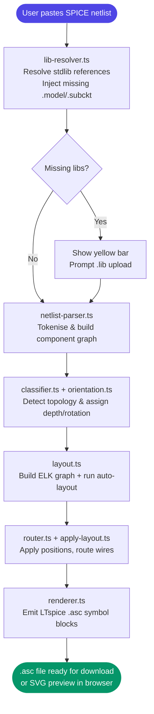
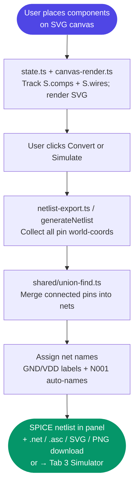
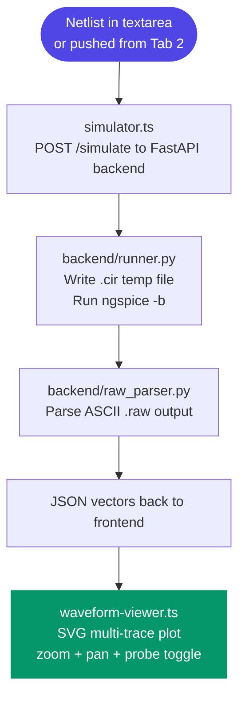

# ⚡ Weave


> **One-liner:** A browser-based EDA suite that converts SPICE netlists to LTspice schematics, lets you draw schematics that generate netlists, and runs real ngspice simulations with live waveform rendering.

---

## 📌 Table of Contents

- [The Problem](#-the-problem)
- [Our Solution & Purpose](#-our-solution--purpose)
- [Why This Over Others](#-why-this-over-others)
- [Tech Stack](#-tech-stack)
- [System Flow](#-system-flow)
- [File Structure](#-file-structure)
- [Prerequisites](#-prerequisites)
- [Installation & Setup](#-installation--setup)
- [Usage](#-usage)
- [Configuration](#-configuration)
- [Screenshots](#-screenshots)
- [Contribution Guidelines](#-contribution-guidelines)
- [Known Limitations & Roadmap](#-known-limitations--roadmap)
- [License](#-license)

---

## 🚨 The Problem

SPICE netlists are text — powerful, but completely opaque to anyone who isn't already familiar with the exact topology. Visualising them requires either expensive EDA software or manual re-drawing. Going the other direction — sketching a schematic and getting a simulation-ready netlist back — is even harder without a full EDA suite installed. And actually running a simulation requires yet another tool.

**Key pain points:**
- ⚠️ Existing SPICE-to-schematic converters require desktop installs or proprietary licences
- ⚠️ No browser-native tool lets you draw a schematic, get a valid SPICE netlist, and simulate it in one workflow
- ⚠️ LTspice `.asc` files are opaque XML-like formats with no readable round-trip path from a plain netlist
- ⚠️ Students and hobbyists have no lightweight, open tool for the full schematic → netlist → simulate loop

---

## 🎯 Our Solution & Purpose

**Weave v5** is a browser-based EDA suite with a real simulation backend — covering the complete schematic ↔ netlist ↔ waveform loop in three integrated tabs.

1. **Tab 1 — Netlist → Schematic** — Paste any SPICE netlist; Weave resolves standard library references automatically, parses the netlist, classifies topology, runs an ELK.js auto-layout, and renders a downloadable LTspice `.asc` schematic. Missing `.lib` files are surfaced with an upload prompt.
2. **Tab 2 — Schematic Editor** — Interactive SVG canvas: place components from a searchable palette, draw wires, add net labels and SPICE directives, rotate/mirror, undo/redo, run ERC, and export SPICE netlist, `.asc`, SVG, or PNG. Sends the netlist directly to Tab 3.
3. **Tab 3 — SPICE Simulator** — Paste or receive a netlist, configure transient / AC / DC / operating point / noise / transfer function / parameter sweep simulations, run it against a FastAPI + ngspice backend, and view live multi-trace waveforms with zoom, pan, and probe toggle.

---

## ⚡ Why This Over Others

| Feature | Weave | KiCad | LTspice | CircuitLab |
|---|:---:|:---:|:---:|:---:|
| Works in the browser | ✅ | ❌ | ❌ | ✅ |
| Zero install for frontend | ✅ | ❌ | ❌ | ❌ |
| SPICE netlist → schematic | ✅ | ❌ | ❌ | ❌ |
| Schematic → SPICE netlist | ✅ | ✅ | ✅ | ✅ |
| LTspice `.asc` export | ✅ | ❌ | ✅ | ❌ |
| Built-in SPICE simulator | ✅ | ✅ | ✅ | ✅ |
| Live waveform viewer | ✅ | ✅ | ✅ | ✅ |
| Full 8-code rotation (R0–MR270) | ✅ | ✅ | ✅ | ❌ |
| Undo / redo stack | ✅ | ✅ | ✅ | ✅ |
| ERC (Electrical Rules Check) | ✅ | ✅ | ✅ | ❌ |
| Open source | ✅ | ✅ | ❌ | ❌ |

---

## 🛠 Tech Stack

### Frontend
| Technology | Version | Purpose |
|---|---|---|
| TypeScript | 5 | All application logic — full static typing across all three tabs |
| SVG | — | Interactive schematic canvas with pan, zoom, grid snap, ghost rendering, waveform plotting |
| HTML5 / CSS3 | — | UI layout, tabs, dark theme |
| Vite | 5 | Dev server with HMR + production bundler |
| elkjs | bundled | Automatic hierarchical graph layout for Tab 1 schematics |

### Backend
| Technology | Version | Purpose |
|---|---|---|
| Python | 3.11+ | Simulation backend runtime |
| FastAPI | 0.115 | REST API (`/ping`, `/simulate`, `/validate`) |
| uvicorn | 0.30 | ASGI server |
| ngspice | system | SPICE circuit simulator (batch mode `-b`) |
| Docker / Compose | — | Containerised backend + frontend dev environment |

### Parsing & Netlist
| Technology | Purpose |
|---|---|
| Custom SPICE parser (`netlist-parser.ts`) | Tokenises and models SPICE netlist elements |
| Standard library resolver (`lib-resolver.ts`) | Injects `.model`/`.subckt` definitions from `stdlib.json` for standard LTspice parts |
| Union-Find (DSU) (`shared/union-find.ts`) | Wire connectivity → net name assignment in Tab 2 |
| Custom `.asc` emitter (`flag-emit.ts`, `renderer.ts`) | Produces valid LTspice schematic files |
| Typed error hierarchy | `WeaveError` → `ParseError \| SymbolError \| LayoutError \| RoutingError` |
| Configurable logger | Single `logger` object with `level` + `onEmit` hook wired to the UI console pane |

---

## 🔄 System Flow

### Tab 1 — Netlist → Schematic



### Tab 2 — Schematic Editor → Netlist



### Tab 3 — Simulator



---

## 📁 File Structure

```
weave/
│
├── index.html                        # Single-page app shell; three-tab layout
├── landing.html                      # Marketing landing page
├── vite.config.ts                    # Vite build and dev server configuration
├── tsconfig.json                     # TypeScript compiler options
├── package.json                      # npm scripts and dependency manifest
├── Dockerfile                        # Backend container image (Python + ngspice)
├── docker-compose.yml                # Orchestrates backend (port 8000) + frontend (port 5173)
├── build_stdlib.py                   # Legacy dev tool (superseded by generate_data.py)
│
├── scripts/
│   └── generate_data.py              # Data pipeline: reads LTspice .asy/.lib/.sub → data/symbols.json + data/stdlib.json
│
├── css/
│   └── style.css                     # Global dark-theme styles
│
├── data/                             # Static data files served by Vite
│   ├── symbols.json                  # Generated: LTspice symbol draw data, pins, attrs (~5.5 MB) — run scripts/generate_data.py
│   ├── stdlib.json                   # Generated: .subckt and .model definitions from LTspice std lib (~6.4 MB)
│   └── symbols_db.json               # Static (checked in): hand-curated primitive overrides (~82 KB)
│
├── lib/                              # Third-party libraries (elkjs bundle)
│
├── backend/                          # FastAPI + ngspice simulation backend (Python)
│   ├── main.py                       # FastAPI app; /ping, /simulate, /validate endpoints
│   ├── runner.py                     # ngspice subprocess orchestrator; writes .cir, reads .raw
│   ├── raw_parser.py                 # ASCII .raw file parser → SimVector / SimResult dataclasses
│   ├── netlist.py                    # Netlist pre-processing: _ensure_control, _inject_save_raw, _resolve_spicelib
│   ├── requirements.txt              # Python dependencies (fastapi, uvicorn, numpy)
│   ├── spicelib/                     # Bundled SPICE model files copied into Docker at /spicelib
│   │   └── standard.lib              # Standard model definitions available to ngspice at runtime
│   └── __init__.py
│
└── src/                              # All frontend source — TypeScript ES modules
    ├── app.ts                        # Entry point; mounts Tab 1, Tab 2, Tab 3; wires logger
    ├── logger.ts                     # Configurable logger (level + onEmit hook)
    ├── errors.ts                     # Typed error hierarchy: WeaveError → ParseError | SymbolError | LayoutError | RoutingError
    ├── asc2net.ts                    # .asc → netlist converter — bidirectional utility
    ├── types.ts                      # Re-exports from shared/types and tab1/types
    │
    ├── shared/                       # Pure utilities — no tab-specific dependencies
    │   ├── types.ts                  # Shared primitives: Point, BBox, RotCode, PinDef, SymbolDef
    │   ├── geometry.ts               # 2D geometry helpers: onSeg, rotBBox, snap
    │   ├── union-find.ts             # Union-Find (DSU) for wire net connectivity
    │   └── topology.ts               # Graph connectivity analysis (topology hints for Tab 1)
    │
    ├── tab1/                         # Netlist → Schematic pipeline (Tab 1)
    │   ├── types.ts                  # Tab 1 types: ParsedComponent, PlacedComponent, ElkGraph, TopologyType, …
    │   ├── convert.ts                # Top-level Tab 1 orchestrator (14-stage pipeline)
    │   ├── lib-resolver.ts           # Stage 0: stdlib resolution — injects .model/.subckt from stdlib_db.json
    │   ├── netlist-parser.ts         # SPICE tokeniser and AST builder
    │   ├── classifier.ts             # Topology classification (series/parallel/bridge/feedback)
    │   ├── layout.ts                 # ELK.js layout wrapper
    │   ├── apply-layout.ts           # Maps ELK output back to component positions
    │   ├── router.ts                 # Wire routing logic
    │   ├── route-types.ts            # Route data types
    │   ├── renderer.ts               # LTspice .asc symbol emitter
    │   ├── flag-emit.ts              # Net flag and GND symbol emitter
    │   ├── flag-placer.ts            # Position logic for power flags
    │   ├── symbols.ts                # LTspice symbol name mapping
    │   ├── orientation.ts            # Component rotation and depth logic
    │   ├── net-repair.ts             # Net connectivity repair passes
    │   ├── place-isolated.ts         # Layout for isolated (unconnected) components
    │   ├── place-repair.ts           # Post-layout position repair
    │   ├── feedback.ts               # Feedback loop detection
    │   ├── feedback-placer.ts        # Layout for feedback topologies
    │   ├── bridge-resolver.ts        # Bridge/H-bridge topology resolver
    │   ├── direct-connector.ts       # Direct wire connections between placed components
    │   ├── verifier.ts               # Output netlist sanity checks
    │   └── wire-merge.ts             # Wire segment simplification + junction detection
    │
    ├── tab2/                         # Schematic Editor (Tab 2)
    │   ├── schematic-editor.ts       # Main editor: toolbar, events, initEditor, mode helpers, clipboard, SVG/PNG export
    │   ├── types.ts                  # Editor types: Comp, Wire, Junction, NetLabel, Directive, EditorState, …
    │   ├── state.ts                  # Singleton EditorState (S), constants (GRID, snap), drag/UI vars
    │   ├── history.ts                # Undo/redo stack: cloneSnap, pushHistory, undo, redo, localStorage persistence
    │   ├── rotation.ts               # Rotation helpers: rotPt, nextRot, toggleMirror, svgTransform
    │   ├── hit-test.ts               # evToWorld, snapToPin, splitWiresAtPins, computeEditorJunctions, ptToSegDist
    │   ├── canvas-render.ts          # render, renderGhost, renderWirePreview, zoomToFit, renderTitleBlock
    │   ├── netlist-export.ts         # generateNetlist, generateAsc, runERC, showERCResults
    │   ├── props-panel.ts            # showProps, showWireProps, showLabelProps, deleteSelected
    │   ├── schematic-symbols.ts      # Component SVG shapes, pin coordinates, palette groups, LOGIC_BEXPR
    │   └── symbols/                  # Symbol definitions split by category
    │       ├── index.ts              # Re-exports all symbol categories
    │       ├── passives.ts           # R, C, L
    │       ├── sources.ts            # V, I, E, G, F, H, B
    │       ├── semis.ts              # D, LED, Zener, Schottky, Q, M, J
    │       ├── opamp.ts              # OPAMP, XFMR, X (subcircuit)
    │       ├── logic.ts              # AND2, OR2, NAND2, NOR2, XOR2, XNOR2, NOT, BUF
    │       ├── switches.ts           # S (voltage-controlled), W (current-controlled), T (tline)
    │       ├── misc.ts               # K (coupling), miscellaneous
    │       └── power.ts              # GND, VDD, VCC, VSS power symbols
    │
    └── tab3/                         # SPICE Simulator UI (Tab 3)
        ├── simulator.ts              # Layout, netlist textarea, run button, backend health ping, waveform/table load
        ├── sim-controls.ts           # Simulation parameter form: .tran / .ac / .dc / .op / .noise / .tf / .step
        ├── waveform-viewer.ts        # SVG multi-trace waveform plotter: zoom (wheel), pan (drag), probe toggle
        └── simulator.css             # Tab 3 styles: sidebar/main flex layout, waveform SVG wrapper
```

---

## 🧰 Prerequisites

| Requirement | Minimum Version | Check Command | Notes |
|---|---|---|---|
| Node.js | 18+ | `node --version` | Required for Vite dev server and build |
| npm | 9+ | `npm --version` | Bundled with Node.js |
| Any modern browser | Chrome 90+ / Firefox 90+ / Safari 15+ | — | ES Modules + SVG required |
| Git | v2.x | `git --version` | For cloning only |
| **For Tab 3 (simulation)** | | | |
| Docker + Docker Compose | v24+ | `docker --version` | Recommended — runs backend + ngspice containerised |
| — OR — Python | 3.11+ | `python --version` | For running backend directly |
| — AND — ngspice | 41+ | `ngspice --version` | Must be on `$PATH` or set `NGSPICE_BIN` |

> ⚠️ **`file://` won't work** — browsers block ES module imports from `file://` origins. Always use the Vite dev server (`npm run dev`).

> ℹ️ **Tab 1 and Tab 2 are fully client-side.** Tab 3 requires the backend only when you click Run.

---

## 🚀 Installation & Setup

### 1. Clone the Repository

```bash
git clone https://github.com/MNADITYA05/weave.git
cd weave
```

### 2. Install Frontend Dependencies

```bash
npm install
```

### 3a. Start with Docker (recommended — includes backend + ngspice)

```bash
docker compose up --build
```

- Frontend: `http://localhost:5173`
- Backend:  `http://localhost:8000`

### 3b. Start without Docker

**Backend:**
```bash
pip install -r backend/requirements.txt
cd backend
uvicorn main:app --host 0.0.0.0 --port 8000 --reload
```

**Frontend (separate terminal):**
```bash
npm run dev
```

### 4. Open in Browser

```
http://localhost:5173
```

### Production Build (optional)

```bash
npm run build
```

Output goes to `dist/` — serve with any static file host. The backend must still be deployed separately for Tab 3.

---

## 💡 Usage

### Tab 1 — Netlist → Schematic

1. Paste a SPICE netlist into the left panel (or pick a built-in example from the dropdown).
2. Click **Convert**.
3. The schematic renders as an SVG on the right.
4. Click **Download .asc** to save a valid LTspice schematic file.

If the netlist references components from external `.lib` files not pasted inline, a yellow bar appears listing the missing parts. Upload the `.lib` / `.sub` files to resolve them and re-run automatically.

**Example input:**
```spice
* RC Low-pass filter
V1 in 0 AC 1
R1 in out 1k
C1 out 0 1n
.ac dec 100 1k 1Meg
.end
```

### Tab 2 — Schematic Editor

1. Click a component in the **left palette** (searchable). Click canvas to place it.
2. Press **R** to rotate or **M** to mirror before/after placing.
3. Click **Wire** (or press **W**), then click two points to draw a wire segment.
4. Press **N** to place a net label; **D** to add a SPICE directive.
5. Click **Convert** to generate the SPICE netlist in the right panel.
6. Click **▶ Simulate** to push the netlist to Tab 3 and run it.
7. Click **.net** / **.asc** / **SVG** / **PNG** to download.

### Tab 3 — SPICE Simulator

1. Netlist appears automatically if sent from Tab 2, or paste one directly.
2. Choose simulation type and set parameters (see table below).
3. Click **▶ Run**. The backend status indicator shows online/offline.
4. Waveforms render in the right panel. Use mouse wheel to zoom, drag to pan.
5. Click probe buttons at the top to toggle individual traces.

**Supported simulation types:**

| Type | SPICE directive | Parameters |
|---|---|---|
| Transient | `.tran` | Stop time, time step |
| AC Sweep | `.ac` | Scale (dec/oct/lin), pts/decade, start/stop freq |
| DC Sweep | `.dc` | Source name, start, stop, step |
| Operating Point | `.op` | None |
| Noise | `.noise` | Output node, input source, freq sweep |
| Transfer Function | `.tf` | Output variable, input source |
| Parameter Sweep | `.step` | Param name, start, stop, increment, inner sim |

### Keyboard Shortcuts (Tab 2)

| Key | Action |
|---|---|
| `W` | Wire mode |
| `B` | Bus wire mode |
| `N` | Net label mode |
| `D` | SPICE directive mode |
| `A` | Text annotation mode |
| `R` | Rotate 90° |
| `M` | Mirror horizontally |
| `F` | Zoom to fit |
| `Escape` | Cancel / return to Select mode |
| `Delete` | Delete selected item |
| `Ctrl+Z` | Undo |
| `Ctrl+Y` | Redo |
| `Ctrl+C / Ctrl+V` | Copy / paste components |

### LTspice Rotation Codes

| Code | Meaning |
|---|---|
| `R0` | No rotation (default) |
| `R90` | 90° counter-clockwise |
| `R180` | 180° |
| `R270` | 270° counter-clockwise |
| `MR0` | Mirrored, no rotation |
| `MR90` | Mirrored + 90° |
| `MR180` | Mirrored + 180° |
| `MR270` | Mirrored + 270° |

---

## ⚙️ Configuration

### Frontend

| Constant | File | Default | Description |
|---|---|---|---|
| `GRID` | `tab2/state.ts` | `16` | Canvas grid snap size in pixels |
| `PIN_SNAP_THRESHOLD` | `tab2/state.ts` | `24` | Pin snap radius in world-px |
| `VITE_SIM_BACKEND` | env / `docker-compose.yml` | `http://localhost:8000` | Backend URL for Tab 3 |
| `logger.level` | `src/logger.ts` | `'info'` | Logging verbosity |

### Backend

| Variable | Default | Description |
|---|---|---|
| `NGSPICE_BIN` | `ngspice` | Path or name of the ngspice executable |
| `NGSPICE_TIMEOUT` | `30` | Max seconds per simulation run |
| `NGSPICE_SPICELIB` | `/spicelib` | Directory of bundled `.lib`/`.mod` files copied into each ngspice temp run |

Set via environment variables or in `docker-compose.yml`.

---

## 🖼 Screenshots

| View | Description |
|---|---|
| **Tab 1 — Netlist → Schematic** | Paste SPICE; routed schematic + download button |
| **Tab 2 — Schematic Editor** | Palette, canvas, properties panel, netlist output |
| **Tab 3 — Simulator** | Sidebar controls, live multi-trace SVG waveforms |

**Tab 2 verified circuits:**

| Circuit | Components |
|---|---|
| RC Low-pass | V, R, C + .ac directive |
| RL Series | V, R, L |
| RLC Series | V, R, L, C |
| Voltage Divider | V, R, R |
| Diode Rectifier | V, D, R |
| NPN Switch | V, R, R, Q_NPN |
| RC Parallel | V, R, C |
| Current Source + R | I, R |
| LED Driver | V, R, LED |
| Wheatstone Bridge | V, R×4 |

---

## 🤝 Contribution Guidelines

We welcome contributions of all kinds — bug fixes, new component symbols, layout improvements, and documentation.

### Getting Started

1. **Fork** the repository
2. **Create** a branch from `main`:
   ```bash
   git checkout -b feat/your-feature-name
   ```
3. **Install** and start:
   ```bash
   npm install && npm run dev
   ```
4. **Make** your changes — Vite HMR reloads automatically
5. **Verify** TypeScript compiles clean:
   ```bash
   npm run typecheck
   ```
6. **Push** to your fork and open a Pull Request

### Branch Naming

| Type | Pattern |
|---|---|
| New feature | `feat/[description]` |
| Bug fix | `fix/[description]` |
| Refactor | `refactor/[description]` |
| Documentation | `docs/[description]` |
| New symbol | `symbol/[component]` |

### Commit Format

Follow [Conventional Commits](https://www.conventionalcommits.org/):

```
feat(editor): add MOSFET symbol with drain/gate/source pins
fix(netlist): correct union-find merge for T-junction wires
refactor(backend): split runner into raw_parser and netlist modules
```

### Pull Request Checklist

- [ ] `npm run typecheck` passes with zero errors
- [ ] New Tab 2 symbols include correct pin coordinates in `schematic-symbols.ts`
- [ ] Wire connectivity verified (place → wire → Convert → check net names)
- [ ] Backend changes tested with `docker compose up --build`
- [ ] PR description explains what changed and why

---

## 🛤 Known Limitations & Roadmap

### Current Limitations

- ⚠️ **No diagonal wires** — Only axis-aligned wire segments supported
- ⚠️ **Single schematic sheet** — No hierarchical or multi-page schematics
- ⚠️ **Tab 3 requires backend** — Simulation is not client-side; ngspice must be installed or Docker used
- ⚠️ **AC simulation returns magnitude only** — Phase data is parsed but not plotted separately

### Roadmap

| Status | Milestone | Version |
|:---:|---|---|
| ✅ Done | SPICE netlist → LTspice `.asc` via ELK.js layout | v1.0 |
| ✅ Done | Interactive SVG canvas with component placement and wire drawing | v1.0 |
| ✅ Done | SPICE netlist generation from canvas (Union-Find connectivity) | v1.0 |
| ✅ Done | Full TypeScript migration (TypeScript 5 + Vite 5) | v1.1 |
| ✅ Done | All 8 LTspice rotation codes (R0–MR270) + mirror | v1.1 |
| ✅ Done | Typed error hierarchy + configurable logger | v1.1 |
| ✅ Done | Undo / redo stack (50-step history + localStorage persistence) | v2.0 |
| ✅ Done | Net labels, SPICE directives, text annotations | v2.0 |
| ✅ Done | ERC (Electrical Rules Check) | v2.0 |
| ✅ Done | SVG + PNG schematic export | v2.0 |
| ✅ Done | LTspice `.asc` export from Tab 2 canvas | v2.0 |
| ✅ Done | Tab 3 SPICE Simulator (FastAPI + ngspice backend) | v5.0 |
| ✅ Done | Live multi-trace waveform viewer (zoom, pan, probe toggle) | v5.0 |
| ✅ Done | Transient / AC / DC sweep simulation types | v5.0 |
| ✅ Done | Codebase modularisation (single-responsibility modules) | v5.0 |
| ✅ Done | Standard library resolver (Situation 2): auto-inject `.model`/`.subckt` from `stdlib.json` | v5.1 |
| ✅ Done | Missing-libs UI: yellow bar + `.lib`/`.sub` file upload for unresolved parts | v5.1 |
| ✅ Done | All 7 simulation types: .tran / .ac / .dc / .op / .noise / .tf / .step | v5.1 |
| ✅ Done | Data pipeline consolidation: 6 JSON files → `symbols.json` + `stdlib.json` via `scripts/generate_data.py` | v5.2 |
| 📋 Planned | AC phase plot (separate magnitude/phase traces) | v5.2 |
| 📋 Planned | Cursor / measurement markers on waveform | v5.2 |
| 📋 Planned | Import `.asc` file back into Tab 2 canvas | v6.0 |
| 📋 Planned | Multi-page / hierarchical schematics | v6.0 |
| 💡 Exploring | PWA / offline mode with service worker | Future |
| 💡 Exploring | WebAssembly ngspice (fully client-side simulation) | Future |

---

## 📚 Documentation

Detailed technical documentation lives in the [`docs/`](./docs/) folder:

| File | Contents |
|---|---|
| [`docs/tab1-pipeline.md`](./docs/tab1-pipeline.md) | Full 14-stage Tab 1 conversion pipeline with worked example |
| [`docs/tab2-editor.md`](./docs/tab2-editor.md) | Schematic editor internals: canvas, state, ERC, export |
| [`docs/tab3-simulator.md`](./docs/tab3-simulator.md) | Simulator UI, all 7 sim types, backend API reference |
| [`docs/elk.md`](./docs/elk.md) | ELK layout engine deep-dive: graph format, algorithm, timeout |
| [`docs/stdlib.md`](./docs/stdlib.md) | Standard library resolver, `stdlib_db.json` build process |
| [`docs/docker.md`](./docs/docker.md) | Docker setup, services, environment variables, spicelib |
| [`docs/data-pipeline.md`](./docs/data-pipeline.md) | Data pipeline: `symbols.json` + `stdlib.json` generation, file formats, key conventions |

---

## 📄 License

This project is licensed under the **MIT License**.
See the [LICENSE](./LICENSE) file for full details.

---

<div align="center">

Built with ❤️ for the electronics community

[⭐ Star this repo](https://github.com/MNADITYA05/weave) · [🐛 Report a Bug](https://github.com/MNADITYA05/weave/issues) · [💡 Request a Feature](https://github.com/MNADITYA05/weave/issues)

</div>
