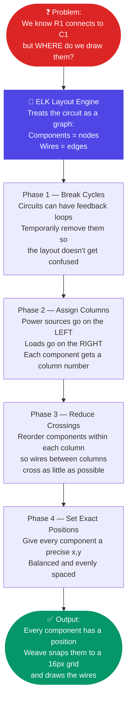
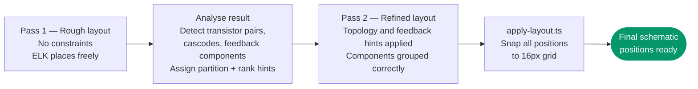

# ELK — Eclipse Layout Kernel

ELK (Eclipse Layout Kernel) is an open-source graph layout engine used in Tab 1 to automatically position schematic components on the canvas. Weave uses the JavaScript port **elkjs**.

---

## What is a "graph layout engine"?

When Tab 1 receives a SPICE netlist, it knows what every component is and how the wires connect them — but it has no idea where to draw anything on the page. There are no positions in a SPICE file, only connections.

A graph layout engine solves exactly this problem. It takes a list of boxes (components) and lines connecting them (wires) and figures out where to place every box so the result looks neat and readable — no boxes on top of each other, wires running as straight as possible, signal flow going left to right.

Think of it like this: imagine you are given a list of cities and a list of roads connecting them, but no map. Your job is to draw the map. The graph layout engine is the algorithm that draws the map.

---

## What ELK Does — Simple Explanation



### The three-pass strategy Weave uses



---

## Why ELK?

A SPICE netlist has no position information — it only specifies connectivity. To produce a readable schematic, components must be placed at (x, y) coordinates and connected by wires that do not overlap awkwardly. This is the **graph layout problem**.

ELK is chosen because:
- It implements the **Layered algorithm** (also called the Sugiyama framework), which is ideal for directed circuits: sources on the left, loads on the right
- It handles large graphs (100+ components) in reasonable time
- The elkjs npm bundle runs entirely in the browser — no server round-trip needed
- It supports explicit layer and partition constraints, which Weave uses for topology-aware placement

---

## How ELK is Invoked (`layout.ts`)

ELK runs inside a **Web Worker** — a background thread that runs separately from the main browser thread. This keeps the page responsive while ELK is computing. You can still see the UI and the loading indicator while ELK works in the background.

```typescript
// layout.ts
const elk = new ELK({ workerUrl: '/lib/elk-worker.js' });

export async function runLayout(graph: ElkGraph): Promise<ElkGraph> {
  const result = await Promise.race([
    elk.layout(graph),
    new Promise((_, reject) =>
      setTimeout(() => reject(new LayoutError('ELK timeout')), 7000)
    )
  ]);
  return result as ElkGraph;
}
```

**The 7-second timeout and worker restart:**

If ELK has not finished within 7 seconds (which can happen on very large or unusually complex netlists), the timeout fires, a `LayoutError` is thrown, and the Web Worker is killed and replaced with a fresh one. Killing the worker resets ELK's internal state completely — any in-progress computation is discarded.

After the worker is restarted, the pipeline does **not** retry ELK. Instead it falls back to a simple grid placement (described below). This is a deliberate choice: if ELK timed out once on a particular graph, retrying it would likely time out again.

---

## ELK Graph Format

ELK operates on a JSON graph structure of nodes and edges. Weave builds this from the placed component list:

```typescript
interface ElkGraph {
  id: string;
  layoutOptions: Record<string, string>;  // global layout settings
  children: ElkNode[];                    // one per component
  edges: ElkEdge[];                       // one per net connection
}

interface ElkNode {
  id: string;           // component id (e.g. 'r1')
  width: number;        // bounding box width
  height: number;       // bounding box height
  layoutOptions?: Record<string, string>;  // per-node overrides
  ports?: ElkPort[];    // one port per pin
}

interface ElkPort {
  id: string;          // e.g. 'r1.p' (component id + pin name)
  properties: {
    'port.side': 'WEST' | 'EAST' | 'NORTH' | 'SOUTH';
  };
}

interface ElkEdge {
  id: string;          // e.g. 'e_net_N001'
  sources: string[];   // ['r1.p']  — port id of the source end
  targets: string[];   // ['c1.n']  — port id of the target end
}
```

### Port sides — and why they are locked

Each pin on each component is assigned a side: WEST (left), EAST (right), NORTH (top), or SOUTH (bottom). This assignment comes from the orientation analysis in Stage 3 of the pipeline.

| Pin role | Port side |
|---|---|
| Input (signal flowing in from the left) | WEST |
| Output (signal flowing out to the right) | EAST |
| Shunt to Ground rail | SOUTH |
| Shunt to Power rail | NORTH |

**Important — port positions are fixed:** ELK is given the constraint `PORT_CONSTRAINTS: FIXED_POS`, which means it is not allowed to move ports to different sides of a node. The sides assigned by Stage 3 are locked. ELK places the nodes, but the pin locations on each node are frozen.

This matters for debugging: if a component's wires look like they are coming from the wrong side, the cause is almost always in Stage 3 (`orientation.ts`) assigning the wrong port side — not in ELK. ELK cannot correct a wrong port assignment.

### Self-edges — the bridge case

Normally, every edge in the ELK graph connects two different nodes (two different components). But occasionally a component has two pins connected to the same net — for example, a wire that loops back, or a component used as a direct bridge. This creates a self-edge: an edge from a node back to itself.

ELK cannot meaningfully route a self-edge. Weave detects these before building the graph and marks those components as **bridges**, handling their wire routing separately outside ELK. They do not appear as edges in the ELK graph at all.

---

## ELK Layout Options

Global layout options passed in `layoutOptions`:

```json
{
  "elk.algorithm": "layered",
  "elk.direction": "RIGHT",
  "elk.layered.spacing.nodeNodeBetweenLayers": "80",
  "elk.spacing.nodeNode": "48",
  "elk.layered.crossingMinimization.strategy": "LAYER_SWEEP",
  "elk.layered.nodePlacement.strategy": "NETWORK_SIMPLEX"
}
```

| Option | Value | What it means in plain terms |
|---|---|---|
| `elk.algorithm` | `layered` | Use the Sugiyama hierarchical layout algorithm |
| `elk.direction` | `RIGHT` | Signal flows left to right across the schematic |
| `nodeNodeBetweenLayers` | `80` | Horizontal gap between columns of components (in abstract units, later scaled to 16px grid) |
| `spacing.nodeNode` | `48` | Vertical gap between components stacked in the same column |
| `crossingMinimization.strategy` | `LAYER_SWEEP` | Reduce wire crossings by sweeping left-to-right and right-to-left alternately |
| `nodePlacement.strategy` | `NETWORK_SIMPLEX` | Set exact component positions using the Network Simplex algorithm |

### Per-edge hints

In addition to the global options, Weave sets a hint on every individual edge:

- **Non-feedback edges** get `elk.layered.priority.straightness: 10` — a high priority telling ELK's crossing-minimisation phase to keep these wires as straight as possible.
- **Feedback loop edges** get `elk.layered.priority.straightness: 0` — no straightness priority, allowing ELK to bend them freely since they must curve back against the signal flow anyway.

---

## The Three-Pass Layout Strategy

Weave runs ELK across three phases — two ELK passes separated by a topology analysis step.

### Pass 1 — Initial layout

The first ELK pass produces a coarse layout based purely on connectivity and the port side constraints. No topology hints are applied. This gives ELK an unbiased starting point and reveals the rough structure of the circuit.

### Between passes — topology analysis and hint injection

After Pass 1, Weave analyses the circuit for known transistor topologies:

- **Differential pairs:** two transistors sharing an emitter (or source) net with different base (or gate) connections. Common in op-amp input stages and comparators.
- **Current mirrors:** transistors sharing a gate or base where one has its drain/collector connected back to its own gate (a diode connection).
- **Cascodes:** one transistor's drain connected directly to another's source, stacking them vertically.
- **Source degeneration:** a transistor's source (or emitter) net shared with a resistor.

When these patterns are detected, Weave injects two types of hints into the ELK graph for Pass 2:

1. **Partition IDs** — components that should be grouped together (like a diff pair) are assigned the same partition ID. ELK's partitioning feature then keeps them in adjacent columns.
2. **Layer constraints** (`elk.layered.layering.layer`) — specific column numbers are assigned to feedback components, ensuring they land in the right part of the schematic rather than wherever ELK would naturally place them.

**Note:** For layer constraints to be respected, ELK's partitioning feature must be explicitly enabled (`partitioning: true` in the layout options for Pass 2). Without this flag, the layer hints are treated as suggestions that ELK may ignore. Partitioning is only active for Pass 2 — Pass 1 runs without it.

### Pass 2 — Topology-aware layout

The second ELK pass re-runs with all the topology hints and layer constraints applied. The result is a layout where matched transistors sit near each other, feedback components land in sensible positions relative to their op-amps, and the overall structure better reflects the circuit's actual topology.

---

## The Layered Algorithm (Sugiyama Framework)

The Layered algorithm runs in four phases. Here is what each one does in plain terms.

### Phase 1 — Cycle Removal

**The problem:** Circuits with feedback create loops in the graph. Imagine a directed graph where every edge points "forward" — except one edge that points backward, creating a cycle. A layout algorithm that tries to assign column numbers to nodes with a cycle gets stuck in an infinite loop (node A must be to the left of node B, but node B must also be to the left of node A).

**The solution:** ELK temporarily removes the minimum number of edges needed to break all cycles — making the graph **acyclic** (acyclic simply means "containing no cycles," the way a family tree has no cycles because no one is their own ancestor). After the layout is computed, those edges are restored and routed as feedback wires going right-to-left.

**In plain terms:** Find the shortest list of wires you could remove to eliminate all loops. Pretend those wires do not exist. Compute the layout. Then add them back as special backward-flowing wires.

### Phase 2 — Layer Assignment

**The problem:** We need to decide which column each component goes in.

**The solution:** ELK uses the **longest path** rule. For every component, count the longest chain of components you must pass through to reach it from any source (voltage or current source). That chain length is the component's column number.

**Why longest path?** Using the longest path (rather than the shortest) guarantees that if component A feeds component B, A will always be in a column to the left of B. No component ever ends up in the same column as something it drives.

**Example for a simple filter chain:**
- V1 (source, nothing feeds it) → column 0
- R1 (fed by V1, longest path from source = 1 hop) → column 1
- C1 (fed by R1, longest path from source = 2 hops) → column 2

### Phase 3 — Crossing Minimisation

**The problem:** Within each column, multiple components are stacked vertically. The order they appear in determines how many wires cross between adjacent columns. Fewer crossings means a cleaner, more readable schematic.

**The solution:** ELK uses the **Layer Sweep** strategy. It makes multiple passes: in one pass it goes left-to-right, in the next right-to-left, each time reordering the components within each column to reduce crossings. After a few passes the order stabilises.

**In plain terms:** Imagine untangling a bundle of cables. You go from one end to the other, untwisting pairs of cables wherever they cross. Then you go back the other way. Repeat until nothing is crossed anymore.

Each component's position in its column is determined by looking at the positions of its neighbours in the adjacent column and finding the **median** — the middle value. Think of it like finding where to sit at a table so you are closest to the average position of the friends you want to talk to.

### Phase 4 — Node Placement

**The problem:** We know which column each component is in and in what order components appear within each column. Now we need exact y-coordinates.

**The solution:** ELK uses the **Network Simplex** algorithm. This is an optimisation technique that treats the layout problem like a flow network — imagine water flowing through pipes — and finds the arrangement that minimises total wire length. Components are spaced to balance compactness against readability, with the spacing constants from the layout options controlling the minimum gaps.

**In plain terms:** Network Simplex finds the positions that make the total length of all wires as short as possible, while respecting the minimum spacing rules. Shorter wires mean a more compact and readable schematic.

---

## Translating ELK Output to World Coordinates

ELK returns positions in abstract units. Weave converts them to LTspice world coordinates (which must be multiples of 16) in `apply-layout.ts`:

```typescript
// ELK abstract position → LTspice world coordinate
const worldX = snap(elkNode.x * SCALE_FACTOR + ORIGIN_X);
const worldY = snap(elkNode.y * SCALE_FACTOR + ORIGIN_Y);
```

- `SCALE_FACTOR` is chosen so that the average component spacing is approximately 160 px (10 × the grid size of 16).
- `ORIGIN_X = 160`, `ORIGIN_Y = 160` gives a left and top margin so components do not sit at the very edge of the canvas.
- `snap()` rounds to the nearest multiple of 16 — LTspice requires all coordinates to be on the grid.

---

## Timeout and Fallback

If ELK takes more than 7 seconds, the pipeline:

1. Throws a `LayoutError('ELK timeout')`
2. Kills the Web Worker (completely resetting ELK's state)
3. Creates a new Web Worker (ready for the next conversion)
4. Falls back to a **grid placement** algorithm

The grid placement simply arranges components in rows and columns, left to right, top to bottom, without considering connectivity at all:

```typescript
for (let i = 0; i < comps.length; i++) {
  comps[i].pos = {
    x: ORIGIN_X + (i % COLS) * COL_SPACING,
    y: ORIGIN_Y + Math.floor(i / COLS) * ROW_SPACING,
  };
}
```

**Honest assessment of the fallback:** The grid placement is correct in the sense that components are all visible and not overlapping. But it ignores which components are connected to which, so related components may end up far apart and wires will span the entire canvas. For circuits with more than about 10 components, the fallback result is typically hard to read. The recommended action when a timeout occurs is to open the `.asc` file in LTspice or Tab 2 and manually rearrange the components into a sensible layout.

---

## ELK and the Web Worker

The elkjs worker is loaded from `lib/elk-worker.js` (bundled by Vite from the `elkjs` npm package). The worker handles all ELK computation off the main thread:

```
Main thread                      Web Worker
──────────────────               ───────────────────────────
layout.ts                        elk-worker.js
  elk.layout(graph)  ──postMessage──►  ELK.layout(graph)
                     ◄──postMessage──  result / error
```

**If the worker cannot start:** Some web servers and CDN configurations enforce a strict Content Security Policy (CSP) — a set of rules that restricts what scripts a page is allowed to run. If the CSP does not permit Web Worker scripts, the worker will fail to load. In that case, elkjs falls back to running ELK synchronously on the main thread. This blocks the UI during layout (the page appears frozen while ELK runs), but the layout itself will still work correctly.

---

## Debugging ELK Issues

If the schematic layout looks wrong, work through these checks in order:

1. **Open the browser console** — ELK errors and warnings are logged there. Look for any red error lines when you click Convert.

2. **Check for `LayoutError: ELK timeout`** — if you see this, ELK ran out of time. Try simplifying the netlist (fewer components), or increase the timeout in `layout.ts` (the `7000` millisecond value on the timeout line).

3. **Wrong port sides (wires coming from wrong direction)** — this is almost always caused by `orientation.ts` assigning the wrong port side, not ELK. Check the `esc` (escape direction) values being passed from Stage 3. Remember: port positions are frozen by `FIXED_POS` — ELK cannot fix a wrong port assignment.

4. **Components in the wrong column** — check the `elk.layered.layering.layer` constraint being set on the component in Pass 2. Also verify that `partitioning: true` is set in the Pass 2 layout options — without it, layer constraints are ignored.

5. **Inspect the raw ELK graph** — add `console.log(JSON.stringify(graph, null, 2))` before the `elk.layout()` call to print the full input graph. Paste it into the [ELK playground](https://rtsys.informatik.uni-kiel.de/elklive/) to visualise it interactively and test different options.

6. **Topology hints not grouping correctly** — if a diff pair or cascode is not being placed together, check `topology.ts`. The detection is heuristic and depends on specific pin-index conventions for BJT and FET models. Non-standard models with different pin orderings will not be detected.
