# Tab 1 — Netlist → Schematic Pipeline

Tab 1 converts a plain-text SPICE netlist into a downloadable LTspice `.asc` schematic file. The conversion runs as a **14-stage pipeline** (plus Stage 0) inside `src/tab1/convert.ts`. Every stage is pure TypeScript — no server round-trip is required. Everything happens in your browser.

---

## What is a "pipeline"?

Think of it like a car assembly line. A raw chassis goes in at one end, and a finished car comes out the other. Each station on the line does one specific job — paint here, tyres there, engine installed next. Each station hands its result to the next one. If any station fails, the line stops and tells you exactly which station broke.

The Tab 1 pipeline works the same way. A raw SPICE netlist text goes in at Stage 0. A finished LTspice schematic comes out at Stage 14. Each stage does one specific job and hands its result to the next.

---

## Pipeline Overview — Visual Flow

```mermaid
flowchart TD
    START([🖊️ You paste a SPICE netlist\ne.g. V1 R1 C1 connected together]) --> S0

    S0["🔍 Stage 0 — Library Lookup\nCheck if part names like '1N4148' or 'LM741'\nexist in the built-in component library.\nIf yes → inject their definition automatically."]
    S0 --> MISSING{Any parts\nnot found?}
    MISSING -- Yes --> WARN["⚠️ Yellow bar appears\nAsking you to upload the\nmissing .lib files"]
    MISSING -- No --> S1
    WARN --> S1

    S1["📖 Stage 1 — Read the Netlist\nUnderstand what components exist\n(resistors, capacitors, voltage sources…)\nand how they are connected"]
    S1 --> S2["🏷️ Stage 2 — Label the Wires\nDecide which wires are Ground,\nwhich are Power Rails, and which\ncarry real signals"]
    S2 --> S3["🧭 Stage 3 — Decide Orientation\nWhich components go left-to-right?\nWhich ones hang vertically to ground?"]
    S3 --> S4["🔄 Stage 4 — Find Feedback Loops\nDetect if any output connects\nback to an earlier input"]
    S4 --> S5["📐 Stage 5-7 — Auto Layout (ELK)\nAn algorithm figures out where\nto place every component on the page\nso wires don't cross awkwardly"]
    S5 --> S6["📌 Stage 8 — Apply Positions\nTranslate the layout into real\nschematic coordinates"]
    S6 --> S7["🔧 Stage 9 — Fix Overlaps\nPush any overlapping components\napart so nothing is on top of each other"]
    S7 --> S8["〰️ Stage 10 — Draw Wires\nConnect component pins with\nneat axis-aligned wire segments"]
    S8 --> S9["🩹 Stage 11 — Repair Connections\nFix any dangling or broken wires\nand resolve crossing conflicts"]
    S9 --> S10["🚩 Stage 12 — Add Power Symbols\nPlace GND, VCC, VDD flags\nat the right locations"]
    S10 --> S11["📄 Stage 13 — Write the .asc File\nGenerate the actual LTspice\nschematic file text"]
    S11 --> S12["✂️ Stage 14 — Clean Up Wires\nMerge short wire pieces into\nlong clean lines; add junction dots"]
    S12 --> DONE([✅ Schematic ready!\nDownload .asc or view SVG preview])

    style START fill:#4F46E5,color:#fff,stroke:none
    style DONE fill:#059669,color:#fff,stroke:none
    style WARN fill:#D97706,color:#fff,stroke:none
```



## Pipeline Overview — Stage List

```
Stage 0   lib-resolver.ts      Resolve stdlib references → inject .model/.subckt
Stage 1   netlist-parser.ts    Tokenise SPICE text → component + net graph
Stage 2   classifier.ts        Label every wire as Ground, Rail, or Signal
Stage 3   orientation.ts       Assign component depth + initial rotation
Stage 4   feedback.ts          Detect feedback loops
Stage 5   layout.ts (ELK)      Build ELK graph; run hierarchical auto-layout (first pass)
Stage 6   topology hints       Adjust layout ranks using circuit topology hints
Stage 7   layout.ts (ELK)      Second ELK pass with adjusted hints
Stage 8   apply-layout.ts      Map ELK node positions → PlacedComponent coords + nudge passes
Stage 9   place-repair.ts      Collision repair: push overlapping components apart
Stage 10  router.ts            Route wires between component pins (12-step constraint router)
Stage 11  net-repair.ts        Repair net connectivity (dangling, crossing)
Stage 12  flag-emit.ts         Place GND / power flag symbols
Stage 13  renderer.ts          Emit LTspice .asc symbol blocks
Stage 14  wire-merge.ts        Merge collinear wire segments; detect junctions
```

---

## Stage 0 — Standard Library Resolution (`lib-resolver.ts`)

**Input:** raw netlist text
**Output:** enriched netlist text + list of missing `.lib` references

### What is happening here, in plain terms?

When you write a SPICE netlist, you often reference parts by name — for example, `1N4148` (a common diode) or `LM741` (a classic op-amp). You don't paste in the full mathematical description of how those parts behave — you just write the name and expect the tool to know what it means.

Stage 0 is the librarian. Before the rest of the pipeline runs, it looks up every part name you used in a pre-built library of ~3,500 component definitions. If it finds the part, it silently copies the definition into your netlist text so the later stages can read it. If it cannot find a part, it puts that name on a "missing" list.

After conversion, if anything is on the missing list, a **yellow bar** appears at the top of the screen listing the unresolved parts. You can upload a `.lib` file containing those definitions, and the pipeline re-runs automatically with your file included.

**One important detail:** Stage 0 also removes any `.lib filename` lines it successfully resolved. This prevents later stages — and ngspice at simulation time — from trying to open files that don't exist on disk.

### Example

Your netlist contains:
```spice
D1 anode cathode 1N4148
```

Stage 0 finds `1N4148` in the library and rewrites the netlist to:
```spice
.model 1N4148 D(Is=2.52n N=1.752 Rs=0.568 ...)
D1 anode cathode 1N4148
```

Stage 1 now sees the full model definition and can parse the diode correctly.

---

## Stage 1 — Netlist Parser (`netlist-parser.ts`)

**Input:** enriched netlist text
**Output:** list of components, list of nets (wires)

### What is happening here, in plain terms?

A SPICE netlist is just a text file. It has no visual information — no positions, no diagram, no picture. It is a list of sentences, where each sentence describes one component and which wires it connects to.

Stage 1 reads that text line by line, like a reader going through a book, and builds two things:

1. A **component list** — every part (resistor, capacitor, diode, transistor, etc.) with its name, value, and which nets its pins connect to.
2. A **net map** — every unique wire name and which component pins touch that wire.

Think of the net map like a party guest list organised by table. Each table is a wire, and each guest sitting at that table is a component pin connected to that wire.

**About continuation lines:** SPICE allows long component descriptions to be split across multiple lines by starting the next line with `+`. Stage 1 joins these back together before reading them. Without this, a component description split across three lines would look like three separate broken entries.

### Example — RC Filter

**Input:**
```spice
* RC Low-pass filter
V1 in 0 AC 1
R1 in out 1k
C1 out 0 1n
.ac dec 100 1k 1Meg
.end
```

**After Stage 1:**
- Components: `V1` (pins: in, 0), `R1` (pins: in, out), `C1` (pins: out, 0)
- Nets: `in` → {V1-positive, R1-left}, `out` → {R1-right, C1-top}, `0` → {V1-negative, C1-bottom}

---

## Stage 2 — Wire Classifier (`classifier.ts`)

**Input:** component list + net map
**Output:** every wire labelled as one of three types: `gnd`, `rail`, or `signal`

### What is happening here, in plain terms?

Not all wires in a circuit are equal. Some carry real signals (audio, data, sensor readings). Some are just the silent reference point that everything is measured against (Ground). Some are constant power supplies (VCC, VDD).

Stage 2 reads through every wire name and decides which category it belongs to:

- **Ground (`gnd`):** Any wire named `0` in SPICE. This is the universal ground reference. Ground wires will be drawn with a special GND symbol instead of a wire.
- **Rail (`rail`):** A wire that a DC voltage source connects to and gives a meaningful name (like `VCC` or `V3V3`). These become power flag symbols in the schematic.
- **Signal (`signal`):** Everything else — the actual circuit signals that change over time.

This labelling matters enormously for the stages that follow. Ground and Rail wires are **never routed as regular wires** — they get flag symbols instead. Signal wires are the ones that get drawn as connecting lines between components.

### Example

In the RC filter: net `0` → `gnd`, net `in` → `rail` (because V1 names it), net `out` → `signal`.

---

## Stage 3 — Orientation (`orientation.ts`)

**Input:** classified component list
**Output:** each component gets a depth number and an initial rotation code

### What is happening here, in plain terms?

In a well-drawn schematic, power flows from left to right. Voltage sources sit on the left. Their output passes through resistors, filters, and amplifiers, moving rightward. The final load sits on the right. Ground connections hang downward.

Stage 3 figures out how far "right" each component is in the signal flow, and which way it should face.

**Depth — what it is:**

Imagine standing at the voltage source and counting how many components you pass through to reach any other component. That count is the "depth." The voltage source has depth 0. A resistor directly connected to it has depth 1. A capacitor connected to that resistor has depth 2. And so on.

This is computed using a technique called **Breadth-First Search (BFS)** — which simply means: start at the source, find everything one step away, then find everything two steps away, and so on, like ripples spreading from a stone dropped in water.

**Rotation codes:**

LTspice uses 8 rotation codes: R0, R90, R180, R270 (straight rotations) and MR0, MR90, MR180, MR270 (mirrored versions). Stage 3 picks the right one for each component based on its depth and which nets it connects to:

- Op-amps → R0 (facing right, input on left, output on right)
- Voltage and current sources → R0 (standing upright on the left)
- Components in the main signal chain → R0 (horizontal, left to right)
- Components hanging to Ground → R90 or R270 (vertical, dropping downward)

### Example — RC Filter

- `V1`: depth=0, rotation=R90 (vertical on the left side)
- `R1`: depth=1, rotation=R0 (horizontal in the middle)
- `C1`: depth=2, rotation=R90 (vertical, shunting to ground)

---

## Stage 4 — Feedback Detection (`feedback.ts`)

**Input:** oriented component list
**Output:** feedback components identified and annotated; op-amp bounding boxes expanded

### What is happening here, in plain terms?

In many amplifier circuits, a component connects the output of an op-amp back to its own input. This is called feedback. A classic example is a resistor connecting the output pin of an op-amp back to its inverting input to set the gain.

Feedback is a problem for automatic layout because it runs against the natural left-to-right flow. If the layout algorithm tries to draw it like a normal left-to-right wire, it will either loop the wire awkwardly or place components in the wrong order.

**What does "traversing the net graph" mean?**

Think of the circuit as a map of roads. Components are towns, wires are roads. A feedback path is a road that loops back — you drive forward for a while and then find yourself returning to a town you already left.

Stage 4 traverses this road map looking for loops. When it finds a component that creates a loop — whose output road leads back to a town already visited — it marks that component as a feedback element.

**What Stage 4 does with feedback components:**

It marks them with one of four labels:
- **Local feedback (`isFb`):** A component directly bridging an op-amp's output back to its input. Taken out of the main layout flow and placed manually in a dedicated corridor above the op-amp.
- **Far feedback (`isFar`):** A component that connects an op-amp output back to a much earlier stage (several depth levels back). Handled separately with a long return wire.
- **Divider leg (`isLeg`):** One end of the component connects to Ground or a power rail, the other to the op-amp's feedback point. Placed as a hanging vertical element.
- **Hanging shunt (`isHang`):** A component hanging to a rail where the signal wire already has other components connected. Placed off to the side.

**Corridor reservation:**

When a feedback component is identified, Stage 4 also expands the op-amp's reserved space on the canvas — like marking out a lane on a road just for that feedback wire. This prevents other components from being placed in the path of the feedback route.

---

## Stages 5–7 — ELK Auto-Layout (`layout.ts`)

**Input:** component list with depth, rotation, and feedback annotations
**Output:** x,y position for every component

### What is happening here, in plain terms?

At this point we know what every component is, which way it faces, and how deep it sits in the signal flow. But we still have no idea where to draw it on the page. That is what ELK does.

**What is ELK?**

ELK stands for Eclipse Layout Kernel. It is a graph layout engine — a program whose sole job is to take a list of boxes (components) and lines connecting them (wires) and figure out where to position everything so the result looks neat and readable.

Think of it like a seating planner for a wedding reception. The guests are the components. The relationships between them (who must sit near whom) are the wires. ELK is the planner that finds an arrangement where related people sit close together and nobody has to walk across the entire room to talk to their neighbour.

**The four phases ELK runs through:**

1. **Break cycles:** Feedback loops make the layout problem impossible to solve directly (it is like trying to draw a family tree where someone is their own ancestor). ELK temporarily pretends certain feedback wires don't exist, solves the layout, then adds them back afterward.

2. **Assign columns:** ELK gives every component a column number — effectively its depth from Stage 3. The voltage source goes in column 0 (leftmost). Whatever it connects to goes in column 1. And so on. This is called "layer assignment." Think of it like assigning every employee to a department floor in a building — floor 0 is reception, floor 1 is sales, floor 2 is engineering.

3. **Reduce crossings:** Within each column, multiple components might stack vertically. ELK reorders them to minimise how many wires cross each other between columns. Think of untangling a bundle of cables — you twist and shuffle until they run as cleanly as possible.

4. **Set exact positions:** Finally, ELK assigns a precise x,y coordinate to each component, spacing them evenly and symmetrically.

**Why does it run twice (Stages 5 and 7)?**

The first pass (Stage 5) gives ELK a clean, unconstrained run — it places components freely based on connectivity alone. The result tells Weave more about the circuit's structure (particularly which components form matching pairs like differential amplifiers). Stage 6 uses that information to inject placement hints — for example, "put these two transistors in the same column and keep them adjacent." Stage 7 then runs ELK again with those hints applied, producing a better-organised layout.

**The 7-second timeout:**

ELK runs inside a background thread (a Web Worker) so the page stays responsive while it works. For very large or complex circuits, ELK can sometimes take a long time. If it takes more than 7 seconds, Weave kills the background thread, starts a fresh one, and falls back to a simpler approach: it places components in a grid, left to right, top to bottom. The result is less beautiful but still usable and correct, and you can then manually rearrange components in Tab 2.

---

## Stage 8 — Apply Layout (`apply-layout.ts`)

**Input:** ELK node positions (abstract units)
**Output:** `PlacedComponent[]` with real LTspice world coordinates

### What is happening here, in plain terms?

ELK thinks in its own abstract units — small numbers like "node at position 3, 2." LTspice requires coordinates that are multiples of 16 (its grid unit). Stage 8 translates between the two, like converting a blueprint drawn at 1:100 scale into actual building measurements.

Every ELK position is multiplied by a scale factor and snapped to the nearest multiple of 16. Then each component gets its pin coordinates calculated — the exact world-space position of each connection point on each component.

**Two nudge passes:**

After the translation, Stage 8 runs two fine-tuning passes that ELK cannot do:

1. **Op-amp nudge:** Moves each op-amp slightly toward the series component feeding it, by up to 32 pixels (2 grid units), so the wire connecting them is short and straight.
2. **Input alignment nudge:** Moves components feeding an op-amp's input to sit on the same horizontal row as that input pin, by up to 48 pixels (3 grid units), so the input wires run horizontally rather than diagonally.

Both nudges are bounded — they will not move a component far enough to create a new overlap — and always snap to the 16-unit grid.

---

## Stage 9 — Collision Repair (`place-repair.ts`)

**Input:** placed components with world coordinates
**Output:** adjusted component positions with no overlaps

### What is happening here, in plain terms?

ELK works in abstract units. When Stage 8 scales those units up to real LTspice coordinates, two components that ELK thought had enough space between them can end up overlapping on the actual canvas.

Stage 9 checks every pair of component bounding boxes. If two components overlap, it pushes them apart along whichever direction requires the smaller move. It repeats this up to 10 times, until no overlaps remain or it runs out of attempts.

Think of it like arranging furniture in a room. After the decorator places everything roughly where it should go, you go through the room pushing chairs and tables apart so nobody trips over anything.

---

## Stage 10 — Wire Router (`router.ts`)

**Input:** placed components with pin world coordinates
**Output:** axis-aligned wire segments connecting every pin to its net

### What is happening here, in plain terms?

This is the most complex stage. At this point, every component has a precise position and every pin has a precise x,y coordinate. Now we need to draw the actual wires connecting them.

Wires in LTspice must be horizontal or vertical — no diagonals. The router's job is to plan a route from every pin to every other pin on the same net, without wires crossing nets they shouldn't cross, without wires running through the middle of components, and respecting all the feedback corridor space reserved in Stage 4.

The router works through twelve steps in sequence:

1. **Escape stubs:** Draw a short stub wire straight out from each pin — enough to clear the component body. This gives the router a clean starting point away from the component boundary.
2. **Feedback job setup:** Prepare the special routing rules for feedback components identified in Stage 4.
3. **Divider leg placement:** Place voltage divider components (the `isLeg` type from Stage 4) as vertical elements hanging off the feedback net.
4. **Main signal routing:** Route the normal left-to-right signal nets using the positions ELK computed.
5. **Bridge resolution:** Some components have two pins on the same net (effectively a short circuit in the layout). These are handled as special "bridge" wires.
6. **Tip deconfliction:** When two wire stubs from different nets would end up at the same point, shift one of them to avoid the collision.
7. **Feedback wiring:** Draw the feedback wires for local op-amp feedback components (`isFb` from Stage 4), routing them through the reserved corridor.
8. **Far feedback wiring:** Draw the long return wires for far feedback components (`isFar` from Stage 4).
9. **Isolated component placement:** Place any components that are not connected to the main signal flow (no ELK edges).
10. **Wire simplification:** Merge redundant wire segments and flush the final wire list.
11. **Hanging shunt placement:** Place the `isHang` shunt components discovered in Stage 4.
12. **Cross-net guard + flag direction + flag emission:** Check that no wire accidentally crosses a net it should not. Fix Ground and power flag orientations. Emit the final GND, VCC, and VDD flag symbols.

**Why is this so complex?**

A simple approach would be: for each net, find all the pins it connects, then draw straight lines between them in the shortest possible way. That works for simple circuits with 3–4 components. For circuits with op-amps, feedback, and power rails, that simple approach produces wires that run through components, cross each other, and make the schematic unreadable. The 12-step router handles all the cases that the simple approach breaks on.

---

## Stage 11 — Net Repair (`net-repair.ts`)

**Input:** routed wire segments
**Output:** repaired wire segments

### What is happening here, in plain terms?

After routing, some wires may be slightly broken:

- A wire segment might start or end at a point with no component pin (a dangling end).
- Two wire segments from different nets might cross each other at a point that is not a proper junction.
- Two segments on the same net might overlap and run on top of each other.

Stage 11 finds and fixes these issues. Think of it as a final check by a draughtsman reviewing a hand-drawn schematic — going through every line, finding any that are disconnected or doubled up, and correcting them.

---

## Stage 12 — Flag Emitter (`flag-emit.ts` + `flag-placer.ts`)

**Input:** net list, placed components
**Output:** GND / power flag symbols at correct positions

### What is happening here, in plain terms?

In LTspice, Ground is not drawn as a wire running to the bottom of the page. Instead, a small GND symbol — a downward-pointing triangle — is placed at every point that connects to Ground. Similarly, named power rails (VCC, VDD, VSS) are drawn as arrow symbols rather than wires running off the edge.

Stage 12 places these symbols at the right locations. `flag-emit.ts` decides what symbols to emit for each net. `flag-placer.ts` figures out a specific x,y position for each symbol that does not overlap any component already placed on the canvas.

---

## Stage 13 — Renderer (`renderer.ts`)

**Input:** placed components, routed wires, flag symbols
**Output:** LTspice `.asc` file text

### What is happening here, in plain terms?

This stage assembles the final text file. It goes through every component, every wire, and every flag symbol and writes the corresponding LTspice directive:

- `WIRE x1 y1 x2 y2` for each wire segment
- `FLAG x y netname` for each power/ground symbol
- `SYMBOL typename x y rotation` for each component
- `SYMATTR InstName R1` for the component's reference designator
- `SYMATTR Value 1k` for the component's value
- `TEXT x y Left 0 .ac dec 100 1k 1Meg` for SPICE simulation directives

The stage also handles a tricky edge case: subcircuit components (those beginning with `X` in SPICE) need a different set of `SYMATTR` entries than simple components like resistors and capacitors. The renderer handles both cases correctly.

---

## Stage 14 — Wire Merge (`wire-merge.ts`)

**Input:** assembled `.asc` text
**Output:** cleaned `.asc` text with merged wires and junction markers

### What is happening here, in plain terms?

The router in Stage 10 produces many short wire segments. For example, a wire running from x=80 to x=464 might be represented as four separate segments: 80→208, 208→336, 336→464. In LTspice, these are visually identical to one long segment, but they take up more file space and are harder to edit.

Stage 14 merges collinear (same direction, touching end-to-end) segments into single longer wires. The 80→208, 208→336, 336→464 example becomes one clean 80→464 wire.

It also detects **junction dots** — the filled circles that LTspice places wherever three or more wires meet at a point (a T-junction or cross-junction). Without junction dots, LTspice treats crossing wires as passing over each other without connecting. Stage 14 finds every such meeting point and emits a `JUNCTION x y` directive for each one.

---

## The Missing-Libs Feedback Loop

One important behaviour that is not visible in the linear stage diagram above: the pipeline can run **more than once** for the same netlist.

When Stage 0 cannot find a part in the built-in library, it adds that part to the "missing" list. After Stage 14 completes, Weave checks this list. If any parts are missing, a yellow bar appears at the top of the page listing their names and offering a file-upload button.

When you upload a `.lib` file containing the missing definitions, Weave injects that file's contents into the netlist text and runs the entire pipeline again from Stage 0. This continues until all parts are resolved or you cancel.

This means the pipeline is not strictly a one-shot process — it is a loop with a human decision point in the middle.

---

## Complete RC Filter Example

**Input netlist:**
```spice
* RC Low-pass filter
V1 in 0 AC 1
R1 in out 1k
C1 out 0 1n
.ac dec 100 1k 1Meg
.end
```

**What each stage does with this circuit:**

- **Stage 0:** No external parts referenced. Nothing to resolve.
- **Stage 1:** Parses three components: V1, R1, C1. Three nets: `in`, `out`, `0`.
- **Stage 2:** Net `0` → Ground. Net `in` → Rail (named by V1). Net `out` → Signal.
- **Stage 3:** V1 depth=0, rotation=R90. R1 depth=1, rotation=R0. C1 depth=2, rotation=R90.
- **Stage 4:** No feedback. No op-amps. Nothing to annotate.
- **Stages 5–7:** ELK places V1 leftmost, R1 in the middle, C1 rightmost.
- **Stage 8:** Converts ELK positions to LTspice coordinates (multiples of 16).
- **Stage 9:** No overlaps to repair.
- **Stage 10:** Draws wires: V1-positive to R1-left, R1-right to C1-top. GND flags emitted for V1-negative and C1-bottom.
- **Stages 11–12:** No dangling wires. GND flags placed below each ground connection.
- **Stage 13:** Emits the full `.asc` text.
- **Stage 14:** Merges short wire segments. No junctions needed (no T-crossings in this simple circuit).

**Output `.asc` (abbreviated):**
```
Version 4
SHEET 1 880 680
WIRE 80 192 208 192
WIRE 208 192 336 192
WIRE 336 192 464 192
WIRE 336 192 336 272
FLAG 80 272 0
IOPIN 80 272 BiDir
FLAG 336 272 0
IOPIN 336 272 BiDir
SYMBOL voltage 80 192 R90
SYMATTR InstName V1
SYMATTR Value AC 1
SYMBOL res 208 192 R0
SYMATTR InstName R1
SYMATTR Value 1k
SYMBOL cap 336 272 R0
SYMATTR InstName C1
SYMATTR Value 1n
TEXT 80 320 Left 0 .ac dec 100 1k 1Meg
```

The resulting `.asc` can be opened directly in LTspice for simulation.

---

## Error Handling

Each stage throws a specific error type if something goes wrong. These all extend the base `WeaveError` class so they can be caught in one place at the top of the pipeline and displayed in the UI with the stage name included.

| Error Class | Stage | What went wrong |
|---|---|---|
| `ParseError` | 1 | The netlist text could not be understood — unrecognised component type, or badly formatted line |
| `SymbolError` | 13 | A SPICE component type has no matching LTspice symbol — for example, a custom model with no known symbol file |
| `LayoutError` | 5–7 | ELK timed out (took more than 7 seconds) or returned no usable positions |
| `RoutingError` | 10 | Two pins on the same net are at exactly the same world coordinate, making it impossible to draw a wire between them |

When an error occurs, the pipeline stops at that stage, and the UI displays a message like "Stage 10 Routing Error: ..." so you know exactly where to look.
