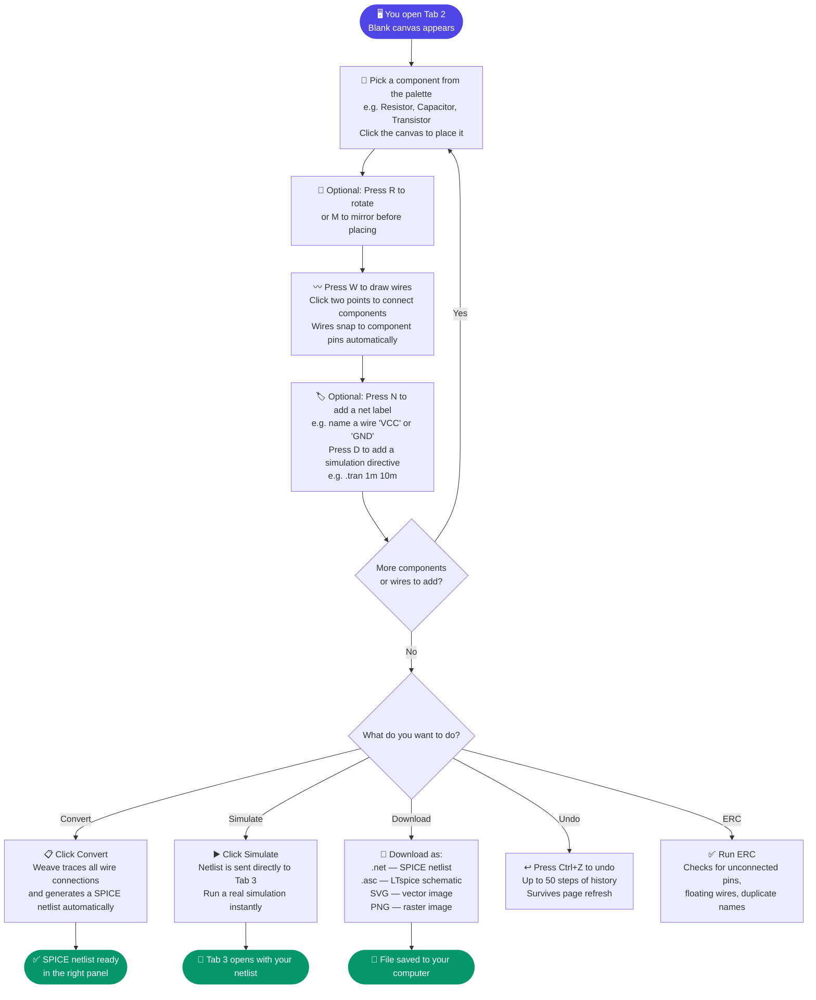
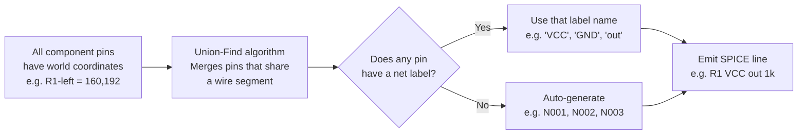

# Tab 2 — Schematic Editor

Tab 2 is a fully interactive browser-based schematic editor built on an SVG canvas. Users place components, draw wires, assign net labels, add SPICE directives, and export a simulation-ready SPICE netlist or LTspice `.asc` file — all without a server.

---

## How Tab 2 Works — Visual Flow



### How wire connections become net names



## Architecture

```
schematic-editor.ts   ← entry point; mounts toolbar, binds all events
      │
      ├── state.ts            Singleton EditorState (S), GRID, snap constants
      ├── canvas-render.ts    render(), renderGhost(), zoomToFit(), title block
      ├── hit-test.ts         evToWorld, snapToPin, splitWiresAtPins, junctions
      ├── history.ts          pushHistory, undo, redo, localStorage persistence
      ├── rotation.ts         rotPt, nextRot, toggleMirror, svgTransform
      ├── netlist-export.ts   generateNetlist, generateAsc, runERC
      ├── props-panel.ts      showProps, showWireProps, deleteSelected
      └── schematic-symbols.ts  component SVG shapes + pin coords + palette
```

---

## Editor State (`state.ts`)

The entire editor state lives in one singleton object `S` of type `EditorState`:

```typescript
export const S: EditorState = {
  comps: [],          // placed components
  wires: [],          // wire segments
  junctions: [],      // T-junction dots
  labels: [],         // net labels
  directives: [],     // .tran / .ac / ... SPICE directives
  annots: [],         // text annotations
  sel: null,          // selected component id
  selWire: null,      // selected wire index
  selLabel: null,     // selected label index
  selDir: null,       // selected directive index
  selAnnot: null,     // selected annotation index
  selMulti: new Set(),       // multi-select: component ids
  selWireMulti: new Set(),   // multi-select: wire indices
  titleBlock: { title, doc, rev, author, date, visible },
  mode: 'select',     // 'select' | 'wire' | 'bus' | 'label' | 'directive' | 'annot' | 'place'
  placing: null,      // component type being placed
  placingRot: 'R0',   // rotation during placement ghost
  wireStart: null,    // {x,y} of in-progress wire
  mouse: { x, y },   // current mouse world position
  pan: { x, y },     // canvas pan offset
  zoom: 1,            // canvas zoom level
  counters: {},       // auto-increment counters per component type (R→1, R→2, ...)
  lastNet: '',        // last used net label (for quick repeat)
};
```

**Key constants:**
- `GRID = 16` — all coordinates are multiples of 16 (LTspice units)
- `snap(v)` — rounds any value to the nearest grid point
- `PIN_SNAP_THRESHOLD = 24` — within 24px of a pin, a wire end snaps to it

---

## Canvas Rendering (`canvas-render.ts`)

The main `render()` function redraws the entire SVG on every state change. SVG is chosen over Canvas because:
- Each element is a DOM node (easy hit-testing with `pointer-events`)
- Transform matrix is applied to a `<g>` group for pan/zoom — no pixel math
- Export to SVG is trivial (the DOM is already SVG)

**Render pipeline:**
1. Clear the SVG `<g>` container
2. Draw grid dots (every GRID px, clipped to viewport)
3. Draw all wire segments as `<line>` elements
4. Draw junction dots as `<circle>` elements
5. Draw all components: for each `Comp`, look up the symbol definition, apply `svgTransform(rot, pos)`, append the symbol's SVG paths + pin circles
6. Draw net labels as `<text>` elements
7. Draw SPICE directives as `<text>` elements
8. Draw annotations
9. If placing, draw the ghost component at `S.mouse` using `renderGhost()`
10. If in wire mode, draw the in-progress wire preview from `S.wireStart` to `S.mouse`

**Pan/zoom:** handled by a `<g transform="translate(px,py) scale(zoom)">` wrapper. Mouse-wheel adjusts `S.zoom`, middle-click drag adjusts `S.pan`.

---

## Component Symbols (`schematic-symbols.ts` + `symbols/`)

Each component type is defined as a `SymbolDef`:

```typescript
interface SymbolDef {
  label: string;          // display name in palette
  group: string;          // palette group (Passives / Sources / Semis / ...)
  svgPaths: string[];     // SVG path 'd' strings (relative to component origin)
  pins: PinDef[];         // [{name, x, y}] in component-local coords
  bexpr?: string;         // netlist export template (for logic gates)
}
```

Symbol categories (split into separate files under `symbols/`):

| File | Components |
|---|---|
| `passives.ts` | R, C, L |
| `sources.ts` | V, I, E (VCVS), G (VCCS), F (CCCS), H (CCVS), B (arbitrary) |
| `semis.ts` | D, LED, Zener, Schottky, NPN/PNP BJT, NMOS/PMOS MOSFET, JFET |
| `opamp.ts` | OPAMP, transformer (XFMR), subcircuit placeholder (X) |
| `logic.ts` | AND2, OR2, NAND2, NOR2, XOR2, XNOR2, NOT, BUF |
| `switches.ts` | S (voltage-controlled), W (current-controlled), T (transmission line) |
| `misc.ts` | K (mutual inductance coupling) |
| `power.ts` | GND, VDD, VCC, VSS |

---

## Wire Drawing & Hit-Testing (`hit-test.ts`)

### Wire mode flow
1. User presses **W** → `S.mode = 'wire'`
2. User clicks → `S.wireStart = snapToPin(evToWorld(e))`
3. Mouse moves → `renderWirePreview()` shows L-shaped preview
4. User clicks again → wire segment added to `S.wires`
5. `splitWiresAtPins()` — checks if the new wire endpoint lands on an existing wire mid-segment; if so, splits that wire into two segments at the intersection point

### Pin snapping
`snapToPin(worldPt)` — scans all placed component pins. If any pin is within `PIN_SNAP_THRESHOLD` (24px) of `worldPt`, the function returns the pin's exact world coordinate instead, guaranteeing electrical connection.

### Junction detection (`computeEditorJunctions`)
After every wire edit, junctions are recomputed:
- A **junction dot** is placed wherever three or more wire endpoints share the same world coordinate (a T-junction or cross-junction)
- Two wires that cross at a non-endpoint do NOT get a junction (they pass over each other)

---

## Rotation System (`rotation.ts`)

LTspice uses 8 rotation codes: `R0, R90, R180, R270, MR0, MR90, MR180, MR270`.

- `nextRot(rot)` — cycles R0 → R90 → R180 → R270 → R0 (press **R**)
- `toggleMirror(rot)` — flips between R and MR variants (press **M**)
- `rotPt(x, y, rot)` — rotates a point in component-local space
- `svgTransform(rot, pos)` — returns the SVG `transform` string for a component: `translate(x,y) rotate(deg) scale(sx,sy)`

Pin coordinates in each `SymbolDef` are always in `R0` space; `rotPt` transforms them to world space when computing absolute pin positions for netlist export.

---

## Undo / Redo (`history.ts`)

- `pushHistory()` — deep-clones `S` (using `cloneSnap`) and pushes onto `_hist[]`; truncates any redo history beyond the current index
- `undo()` — steps back one snapshot, restores `S` from `_hist[--_histIdx]`
- `redo()` — steps forward one snapshot
- History limit: 50 snapshots
- **Persistence:** on every push, the current state is also saved to `localStorage` under `STORAGE_KEY = 'weave-sc-v1'` so the canvas survives a page refresh

`cloneSnap` uses `JSON.parse(JSON.stringify(...))` for a cheap deep clone — works because `S` contains only plain objects, arrays, and primitives.

---

## Netlist Export (`netlist-export.ts`)

### `generateNetlist()`

Converts the canvas state to a SPICE netlist:

1. Collect all component pin world-coordinates (applying rotation via `rotPt`)
2. Collect all wire segments
3. Run **Union-Find** (`shared/union-find.ts`): for each wire, `union(pinA, pinB)` by coordinate
4. Merge all wire-connected pins into the same net group
5. Assign net names:
   - If a `NetLabel` exists at a pin's coordinate → use that label name
   - Else if the net includes a `GND` power symbol → name it `0`
   - Else auto-generate `N001`, `N002`, …
6. Emit one SPICE line per component (e.g., `R1 N001 N002 1k`)
7. Append all `.tran` / `.ac` / … directives from `S.directives`
8. Append `.end`

### `generateAsc()`

Emits a full LTspice `.asc` file from the canvas state — same data as the renderer in Tab 1 but sourced from `S.comps` instead of a parsed netlist.

### `runERC()`

Electrical Rules Check — scans for:
- **Unconnected pins** — pin has no wire reaching it (warning)
- **Floating nets** — net with only one connection (error)
- **Duplicate component names** — two components with the same `InstName` (error)
- **Missing reference** — component value is empty (warning)

Results are displayed in a dismissable overlay panel.

---

## Export Formats

| Button | Format | Function |
|---|---|---|
| `.net` | SPICE netlist text | `generateNetlist()` |
| `.asc` | LTspice schematic | `generateAsc()` |
| `SVG` | Scalable vector | Serialise the SVG DOM |
| `PNG` | Raster image | Draw SVG onto an offscreen Canvas, `toDataURL` |
| `▶ Simulate` | Push to Tab 3 | `sendToSimulator(netlist)` via localStorage event |

---

## Multi-Select

- Hold **Shift** and click components to add to `S.selMulti`
- Drag any selected component → all selected components move together
- **Delete** removes all selected components and any wires connecting only selected components
- **Ctrl+C** copies the selection to an internal clipboard; **Ctrl+V** pastes at the current mouse position with net labels stripped (pins reconnect by position)
