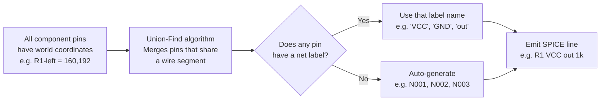

# Tab 2 — Schematic Editor

Tab 2 is a fully interactive browser-based schematic editor built on an SVG canvas. Users place components, draw wires, assign net labels, add SPICE directives, and export a simulation-ready SPICE netlist or LTspice `.asc` file — all without a server. Everything happens inside your browser.

---

## What is a "schematic editor"?

Think of it as a digital drawing board for circuits. Instead of drawing boxes and lines freehand, you pick components from a menu (resistor, capacitor, transistor, op-amp), click to place them on a grid, then draw wires connecting their pins. When you are done, the editor reads all those wire connections and automatically writes out a text description of your circuit — a SPICE netlist — that a simulator can run.

The key difference from a general drawing tool like PowerPoint or Figma is that Tab 2 understands electricity. It knows which ends of a resistor are which, it knows that Ground is special, and it can verify whether your connections make electrical sense before you simulate.

---

## How Tab 2 Works — Visual Flow


### How wire connections become net names



---

## Architecture

```
schematic-editor.ts   ← entry point; mounts toolbar, binds all keyboard and mouse events
      │
      ├── state.ts            Singleton EditorState (S), GRID, snap constants
      ├── canvas-render.ts    render(), renderGhost(), zoomToFit(), title block
      ├── hit-test.ts         evToWorld, snapToPin, splitWiresAtPins, junctions
      ├── history.ts          pushHistory, undo, redo, localStorage persistence
      ├── rotation.ts         rotPt, nextRot, toggleMirror, svgTransform
      ├── netlist-export.ts   generateNetlist, generateAsc, runERC
      ├── props-panel.ts      showProps, showWireProps, deleteSelected
      └── schematic-symbols.ts  component SVG shapes + pin coords + palette
```

---

## Editor State (`state.ts`)

### What is "state"?

Every application has to remember what it is currently showing. When you place a resistor, the editor needs to remember where it is. When you draw a wire, it needs to remember where the wire starts and ends. When you undo something, it needs to remember what the canvas looked like before.

All of this remembered information is called "state." In Tab 2, every single piece of state lives in one central object called `S` (short for State). Think of it like the single whiteboard in a meeting room that everyone in the team reads from and writes to.

```typescript
export const S: EditorState = {
  comps: [],          // placed components
  wires: [],          // wire segments
  junctions: [],      // T-junction dots
  labels: [],         // net labels
  directives: [],     // .tran / .ac / ... SPICE directives
  annots: [],         // text annotations
  sel: null,          // selected component id
  selWire: null,      // selected wire index
  selLabel: null,     // selected label index
  selDir: null,       // selected directive index
  selAnnot: null,     // selected annotation index
  selMulti: new Set(),       // multi-select: component ids
  selWireMulti: new Set(),   // multi-select: wire indices
  titleBlock: { title, doc, rev, author, date, visible },
  mode: 'select',     // current editing mode
  placing: null,      // component type being placed (if in place mode)
  placingRot: 'R0',   // rotation of the ghost component during placement
  wireStart: null,    // {x,y} of the wire being drawn (if in wire mode)
  mouse: { x, y },   // current mouse world position
  pan: { x, y },     // canvas pan offset
  zoom: 1,            // canvas zoom level
  counters: {},       // auto-increment counters per component type
  lastNet: '',        // last used net label (for quick repeat)
};
```

**Key constants:**
- `GRID = 16` — all coordinates are multiples of 16. This matches LTspice's grid. You can think of the canvas as graph paper where each square is 16 units wide.
- `snap(v)` — a function that rounds any number to the nearest multiple of 16, like snapping a magnet to a grid.
- `PIN_SNAP_THRESHOLD = 24` — when you draw a wire and your cursor is within 24 units of a component pin, the wire end jumps (snaps) exactly onto that pin. This guarantees a proper electrical connection.

**The title block:**
The `titleBlock` field stores the standard engineering drawing information that appears in the corner of professional schematics: the circuit title, document number, revision number, author name, and date. Setting `visible: false` hides it from the canvas. These fields also appear in exported `.asc` files.

**The editing modes:**

Tab 2 is always in exactly one mode at a time. Modes are like tools on a toolbar — only one can be active:

| Mode | How to enter | What happens when you click the canvas |
|---|---|---|
| `select` | Escape key | Selects or deselects components |
| `wire` | W key | Draws a wire from click to click |
| `bus` | B key | Draws a bus (multi-net bundle) |
| `label` | N key | Places a net name label |
| `directive` | D key | Places a SPICE directive (`.tran`, `.ac`, etc.) |
| `annot` | T key | Places a text annotation |
| `place` | Click a palette item | Places the selected component type |

---

## Canvas Rendering (`canvas-render.ts`)

### What is happening here, in plain terms?

Every time anything changes on the canvas — a component moves, a wire is drawn, the user clicks — the entire canvas is redrawn from scratch. Think of it like refreshing a painting: rather than trying to surgically erase and repaint just the changed part, the code throws away the whole picture and repaints everything in about a millisecond.

The canvas is drawn using **SVG** (Scalable Vector Graphics) — a format where every line, circle, and shape is a proper object that the browser knows about, rather than a flat grid of pixels. This makes hit-testing (figuring out what the user clicked on) straightforward, and makes export to SVG trivial — the DOM is already SVG.

**Render order (what gets painted first is at the back):**
1. Grid dots — the faint dot pattern in the background, every 16 units
2. Wire segments — drawn as lines, coloured differently when selected
3. Junction dots — filled circles where three or more wires meet
4. Components — each component's SVG shape, with pin dots and a transparent hit area for clicking
5. Net labels — styled text boxes naming the wires
6. SPICE directives — monospaced text boxes (`.tran 1m`, `.ac dec 100`, etc.)
7. Annotations — free text
8. Ghost component — a semi-transparent preview of the component being placed, follows the mouse
9. Wire preview — an L-shaped line showing where the wire will go as you move the mouse

**Pan and zoom:** The entire canvas content sits inside a single SVG group element with a `transform` applied to it. When you scroll to zoom, the zoom number changes and the transform is recalculated. When you drag to pan, the pan offset changes. This means only one number changes to move everything — no individual component positions are touched.

**SVG export note:** Because the canvas uses a transform for pan and zoom, exporting the SVG captures the canvas exactly as it appears on screen, including any pan and zoom state. If you are zoomed into one corner, the exported SVG will show only that corner. Use "Zoom to Fit" before exporting to capture the full schematic.

---

## Component Symbols (`schematic-symbols.ts` + `symbols/`)

### What is happening here, in plain terms?

Every component type needs two things: a picture (so you can see it on the canvas) and a pin list (so the editor knows where to snap wires). Both are stored together in a `SymbolDef` object.

```typescript
interface SymbolDef {
  label: string;       // display name in the palette, e.g. "Resistor"
  group: string;       // palette group, e.g. "Passives"
  svgPaths: string[];  // SVG path commands that draw the component shape
  pins: PinDef[];      // [{name, x, y}] — where each pin is located
  bexpr?: string;      // netlist template for logic gates
}
```

The pin coordinates are always stored in **R0 orientation** — meaning the component is assumed to be pointing right with no rotation. When the user rotates a component, the pin positions are mathematically transformed using the rotation code. Think of it like a rubber stamp: the stamp image is always stored facing one direction, but you can rotate the stamp before pressing it down.

Symbol definitions are split into eight files by component category:

| File | What is in it |
|---|---|
| `passives.ts` | Resistor (R), Capacitor (C), Inductor (L) |
| `sources.ts` | Voltage source (V), Current source (I), and the four controlled sources (E, G, F, H) and arbitrary source (B) |
| `semis.ts` | Diode (D), LED, Zener, Schottky, NPN/PNP bipolar transistors, NMOS/PMOS MOSFETs, JFETs |
| `opamp.ts` | Op-amp, transformer (XFMR), subcircuit placeholder (X) |
| `logic.ts` | AND, OR, NAND, NOR, XOR, XNOR, NOT, BUF gates |
| `switches.ts` | Voltage-controlled switch (S), current-controlled switch (W), transmission line (T) |
| `misc.ts` | Mutual inductance coupling (K) |
| `power.ts` | GND, VDD, VCC, VSS power symbols |

---

## Wire Drawing and Hit-Testing (`hit-test.ts`)

### Wire mode — step by step

1. Press **W** → the editor enters wire mode
2. Move the mouse → the canvas shows an L-shaped wire preview following the cursor. If the cursor is within 24 units of any component pin, the preview snaps to that pin exactly.
3. Click to start → the wire's starting point is locked in.
4. Move the mouse → the preview now shows the route from the start point to the cursor.
5. Click to finish → the wire segment is added to the schematic.

**What happens immediately after a wire is drawn — `splitWiresAtPins()`:**

This is an important step that the basic description above leaves out. When a new wire is finished, the editor checks whether either endpoint of that new wire lands in the middle of an existing wire — not at an endpoint, but mid-segment.

Imagine you already have a long horizontal wire running from A to B. You then place a resistor whose pin lands at point M, which is somewhere in the middle of that wire. Without any extra step, the wire runs straight through the resistor pin without making an electrical connection — like a road passing over a building instead of stopping at its door.

`splitWiresAtPins()` detects this situation and splits the existing A→B wire into two segments: A→M and M→B. Now point M is an endpoint of both new segments, and the resistor pin connects cleanly to the wire. This happens automatically every time a component is placed or a wire is finished.

### Junction detection — `computeEditorJunctions()`

A **junction dot** is the filled circle you see in schematics where three or more wires meet at the same point. Without it, two wires that cross look ambiguous — are they connected or passing over each other? The junction dot makes the connection explicit.

After every wire edit, the editor recomputes all junctions. It scans every wire against every other wire and counts how many endpoints share the same coordinate. If three or more endpoints share a point, a junction is placed there.

**A note on performance:** This scan compares every wire to every other wire. In computer science terms, this is an O(n²) operation — if you double the number of wires, the scan takes four times as long. For small schematics (under 100 wires) this is imperceptibly fast. Around 200–300 wires it becomes slightly sluggish. A `_junctionsDirty` flag avoids rerunning the scan when nothing has changed, which helps considerably in practice.

---

## Rotation System (`rotation.ts`)

### What are the 8 rotation codes?

LTspice represents component orientation using 8 codes: `R0`, `R90`, `R180`, `R270` (pure rotations) and `MR0`, `MR90`, `MR180`, `MR270` (mirror then rotate).

Think of it like handling a playing card:
- R0 = card face up, pointing right (no change)
- R90 = card rotated 90° clockwise
- R180 = card upside down
- R270 = card rotated 90° anti-clockwise
- MR0 = card flipped face-down, then not rotated (mirrored left-right)
- MR90 = card flipped, then rotated 90°
- ...and so on

**Keyboard shortcuts:**
- Press **R** while placing → cycles through R0 → R90 → R180 → R270 → R0
- Press **M** while placing → toggles between the non-mirrored and mirrored variant

**The key functions:**

- `nextRot(rot)` — returns the next rotation code in the cycle when you press R
- `toggleMirror(rot)` — swaps between R and MR variants when you press M
- `rotPt(x, y, rot)` — takes a pin position in the component's local (R0) coordinate space and returns where that pin actually sits in world space after rotation. This is how the editor knows where to snap wires.
- `svgTransform(rot, pos)` — returns the SVG `transform` string that draws the component's symbol at the right position and orientation on the canvas

---

## Undo / Redo (`history.ts`)

### What is happening here, in plain terms?

Every time you make a change — place a component, draw a wire, delete something — the editor takes a complete snapshot of the entire canvas state and stores it. When you press Ctrl+Z, it rolls back to the previous snapshot.

Think of it like the "track changes" feature in a word processor, but instead of tracking individual keystrokes, it saves a full copy of the document after each action.

**The 50-step limit:** The editor keeps the last 50 snapshots. If you make a 51st change, the oldest snapshot is discarded. This prevents the browser from running out of memory on very large or long editing sessions.

**localStorage persistence:** Every time a snapshot is saved, a copy is also written to the browser's local storage — a small private storage area your browser maintains for each website. This means if you accidentally close the tab or the page refreshes, your schematic is not lost. When Tab 2 loads, it checks local storage and restores the last saved state.

**Important technical detail — the cloning method:**

Each snapshot is created by deep-cloning the state object using `JSON.parse(JSON.stringify(state))`. This is a quick and simple technique: convert the whole object to a JSON text string, then parse it back into a fresh object. Any nested arrays and objects get their own independent copies.

However, this method has one known limitation: it cannot correctly clone JavaScript `Set` objects. `S.selMulti` and `S.selWireMulti` — which store the currently selected items during a multi-select operation — are `Set` instances. When serialised to JSON and back, a `Set` becomes an empty object `{}`, losing all its contents.

In practice this means: if history is pushed while a multi-selection is active, restoring that snapshot will clear the selection silently. For normal single-item selection and for all component/wire data (which uses plain arrays), cloning works perfectly. This is a known limitation to be aware of if extending the editor.

---

## Netlist Export (`netlist-export.ts`)

### `generateNetlist()` — how wires become text

This is the core export function. It reads the visual canvas and produces a text file a SPICE simulator can understand. Here is how it works:

**Step 1 — Collect pin positions.**
For every placed component, calculate the world coordinates of each of its pins. This uses `rotPt()` to account for whatever rotation the component has been given.

**Step 2 — Run Union-Find.**
This is the algorithm that figures out which pins are electrically connected.

What is Union-Find? Imagine you have a pile of name badges, one per component pin. Every time two pins are connected by a wire, you staple those two badges together into a group. After processing all wires, each group of stapled badges represents one electrical net — one connected wire in the circuit.

Union-Find is simply a very efficient way of doing this stapling operation. It keeps track of which badge belongs to which group, and merging two groups (when a new wire connects them) is nearly instantaneous regardless of how large the groups are.

**Step 3 — Assign net names.**
Once all pins are grouped, each group needs a name:
- If any pin in the group has a net label placed on it (a name you typed using the N key), that name is used.
- If any pin in the group connects to a GND power symbol, the net is named `0` (the universal SPICE ground name).
- Otherwise, an auto-generated name is used: `N001`, `N002`, `N003`, and so on.

**Step 4 — Emit SPICE lines.**
For each component, look up which net each of its pins belongs to, then write the SPICE component line. For example, a resistor R1 with its left pin on net `VCC` and its right pin on net `out` with a value of `1k` becomes:
```spice
R1 VCC out 1k
```

**Step 5 — Append directives and `.end`.**
All simulation directives from `S.directives` (the `.tran`, `.ac`, `.dc` lines you placed on the canvas) are appended, followed by `.end`.

### `generateAsc()` — exporting for LTspice

This function produces a `.asc` file — the native LTspice schematic format. It uses the same wire and component data as `generateNetlist()` but emits LTspice-specific directives (`WIRE`, `FLAG`, `SYMBOL`, `SYMATTR`) instead of SPICE lines. The result can be opened directly in LTspice.

### `runERC()` — Electrical Rules Check

ERC is an automatic sanity check that looks for common wiring mistakes before you simulate. It runs five checks:

| Check | Severity | What it means |
|---|---|---|
| No GND symbol present | Error | Every SPICE circuit needs a ground reference (net named `0`). Without one, the simulator cannot solve the circuit. |
| Duplicate reference designators | Error | Two components have the same name (e.g., two resistors both named R1). The netlist would be ambiguous. |
| Missing reference designator | Warning | A component has no name assigned. The netlist export will auto-generate one, but it is good practice to name things explicitly. |
| Unconnected pins | Warning | A component pin has no wire reaching it. This is often a mistake — a forgotten connection. |
| Floating net | Error | A net has only one connection. Electricity cannot flow through a dead-end wire — the net goes nowhere. |

Results appear in a dismissable overlay panel with ERROR badges (must fix before simulating) and WARN badges (worth checking, but not fatal).

---

## Export Formats

| Button | Format | What you get |
|---|---|---|
| `.net` | SPICE netlist text | A plain-text file you can paste into any SPICE simulator |
| `.asc` | LTspice schematic | Open directly in LTspice for simulation or editing |
| `SVG` | Scalable vector image | A vector file you can open in Inkscape, Illustrator, or a browser — scales to any size without blurring |
| `PNG` | Raster image | A pixel image — good for pasting into documents or presentations |
| `▶ Simulate` | Push to Tab 3 | Writes the netlist to browser storage and notifies Tab 3 to load it |

**How the Tab 3 handoff works:** Clicking Simulate writes the netlist to a browser storage key (`weave-sim-netlist`) and fires a storage event. Tab 3, if open, listens for this event and loads the netlist immediately. If Tab 3 is already open but was opened before you clicked Simulate, it also checks for a new netlist every time you switch focus to its tab — so switching to Tab 3 will always pick up the latest netlist even if the event was missed.

---

## Multi-Select

You can select multiple components at once to move or delete them together:

- Hold **Shift** and click components to add them to the multi-selection
- Hold **Shift** and drag to draw a selection rectangle around a group of components
- Drag any selected component → all selected components move together, maintaining their relative positions
- Press **Delete** → removes all selected components and any wires that connected only to selected components (wires with one end on a non-selected component are left in place)

**Copy and paste:**
- **Ctrl+C** copies the selection to an internal clipboard
- **Ctrl+V** pastes at the current mouse position

When pasting, net label names are stripped from the pasted components — the pasted copies get fresh auto-generated net names instead of inheriting the originals. Physical position determines connection: if a pasted component pin lands exactly on an existing wire coordinate, they connect electrically.

**Bus wires:**
In addition to regular single-net wires, Tab 2 supports bus wires — thick lines that represent multiple signals bundled together (common in digital circuits). Press **B** to enter bus drawing mode. Bus wires are rendered thicker than regular wires and are labelled differently in the exported netlist.

---

## Keyboard Shortcuts Reference

| Key | Action |
|---|---|
| **W** | Enter wire drawing mode |
| **B** | Enter bus drawing mode |
| **R** | Rotate component (while placing or selected) |
| **M** | Mirror component (while placing or selected) |
| **N** | Place a net label |
| **D** | Place a SPICE directive |
| **T** | Place a text annotation |
| **Escape** | Return to select mode / cancel current action |
| **Delete** | Delete selected component(s) or wire(s) |
| **Ctrl+Z** | Undo (up to 50 steps) |
| **Ctrl+Y** | Redo |
| **Ctrl+C** | Copy selection |
| **Ctrl+V** | Paste |
| **Ctrl+A** | Select all |
| **Scroll wheel** | Zoom in / out |
| **Middle-click drag** | Pan the canvas |

---

## Error Handling

Tab 2 does not throw hard errors in the same way as the Tab 1 pipeline — the editor is interactive and tolerates incomplete states. Instead, problems surface in two ways:

1. **ERC warnings and errors** — shown when you explicitly run the Electrical Rules Check before exporting or simulating.
2. **Export-time warnings** — if `generateNetlist()` encounters a component with an unresolvable net (no wire and no label), it emits an auto-generated name and continues rather than stopping.

The philosophy is: let you keep working even with incomplete circuits, and surface issues when you ask for them.
