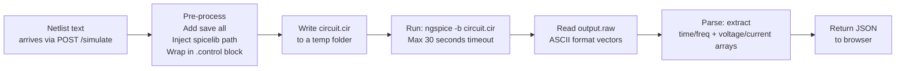

# Tab 3 — SPICE Simulator

Tab 3 connects the browser frontend to a real **ngspice** simulation engine running in a FastAPI backend. Users configure a simulation, click Run, and see live multi-trace waveforms rendered in the browser.

---

## How Tab 3 Works — Visual Flow


### What happens inside the backend



## Architecture

```
Browser (Tab 3)                         Backend (FastAPI + ngspice)
──────────────────────────────          ──────────────────────────────
simulator.ts                            main.py
  └── sim-controls.ts (param form)        └── POST /simulate
  └── waveform-viewer.ts (SVG plot)            └── runner.py
                                                   ├── Write .cir file
                                                   ├── Run ngspice -b
                                                   └── raw_parser.py → JSON
```

---

## Frontend: `simulator.ts`

`initSimulator(root: HTMLElement)` builds the Tab 3 layout and wires all events:

```
┌─────────────────────────────────────────────────────────────┐
│  Tab 3                                                       │
│  ┌────────────────┐  ┌───────────────────────────────────┐  │
│  │ Sidebar        │  │ Main panel                        │  │
│  │ Netlist area   │  │ Waveform SVG  (zoom + pan)        │  │
│  │ Sim type form  │  │  — or —                           │  │
│  │ ▶ Run          │  │ Table view (numeric output)       │  │
│  │ Backend: ●     │  │                                   │  │
│  └────────────────┘  └───────────────────────────────────┘  │
└─────────────────────────────────────────────────────────────┘
```

**Backend health indicator:** on mount, `simulator.ts` pings `GET /ping`. The status dot is:
- 🟢 green if the backend responds with `{"status": "ok"}`
- 🔴 red if the request fails (backend offline / Docker not running)

**Netlist push from Tab 2:** `app.ts` writes `localStorage['weave-sim-netlist']` and fires a `storage` event. Tab 3 listens for this event and populates the netlist textarea automatically.

---

## Simulation Controls: `sim-controls.ts`

`createSimControls()` returns `{ el, getParams() }` — a form element and a function that reads the current values.

### Supported simulation types

#### `.tran` — Transient

```
Stop time:   [________]   e.g. 10m  (10 ms)
Time step:   [________]   e.g. 1u   (1 µs)
```

Emits: `.tran <step> <stop>`

#### `.ac` — AC Sweep

```
Scale:       [dec ▼]      dec | oct | lin
Pts/decade:  [________]   e.g. 100
Start freq:  [________]   e.g. 1k
Stop freq:   [________]   e.g. 1Meg
```

Emits: `.ac dec 100 1k 1Meg`

#### `.dc` — DC Sweep

```
Source:  [________]   e.g. V1
Start:   [________]   e.g. 0
Stop:    [________]   e.g. 5
Step:    [________]   e.g. 0.1
```

Emits: `.dc V1 0 5 0.1`

#### `.op` — Operating Point

No parameters. Emits: `.op`

#### `.noise` — Noise Analysis

```
Output node:  [________]   e.g. V(out)
Input source: [________]   e.g. V1
Scale:        [dec ▼]
Pts/decade:   [________]
Start freq:   [________]
Stop freq:    [________]
```

Emits: `.noise V(out) V1 dec 100 1 1Meg`

#### `.tf` — Transfer Function

```
Output variable: [________]   e.g. V(out)
Input source:    [________]   e.g. V1
```

Emits: `.tf V(out) V1`

#### `.step` — Parameter Sweep

```
Param name:  [________]   e.g. R_val
Start:       [________]   e.g. 1k
Stop:        [________]   e.g. 10k
Increment:   [________]   e.g. 1k
Inner sim:   [________]   e.g. .tran 1u 10m
```

Emits:
```spice
.step param R_val 1k 10k 1k
.tran 1u 10m
```

---

## Backend: FastAPI (`main.py`)

### Endpoints

| Method | Path | Description |
|---|---|---|
| `GET` | `/ping` | Health check — returns `{"status": "ok"}` |
| `POST` | `/simulate` | Run a simulation; returns waveform vectors |
| `POST` | `/validate` | Check netlist syntax without simulating |

### `/simulate` request body

```json
{
  "netlist": ".title RC filter\nV1 in 0 AC 1\nR1 in out 1k\nC1 out 0 1n\n.ac dec 100 1k 1Meg\n.end",
  "sim_type": "ac"
}
```

### `/simulate` response

```json
{
  "status": "ok",
  "vectors": {
    "frequency": [1000.0, 1023.3, ...],
    "V(out)":    [0.9998, 0.9991, ...]
  },
  "log": "ngspice stdout/stderr"
}
```

Error response (ngspice failure):
```json
{
  "status": "error",
  "message": "ngspice exited with code 1",
  "log": "Error: no such node 'oout'"
}
```

---

## Backend: Runner (`runner.py`)

`run_simulation(netlist: str, sim_type: str) → SimResult`

1. Creates a temp directory under `/tmp/weave_<uuid>/`
2. Pre-processes the netlist via `netlist.py`:
   - `_ensure_control()` — wraps in `.control` / `.endc` block if missing
   - `_inject_save_raw()` — adds `save all` and `write <output.raw>` directives
   - `_resolve_spicelib()` — prepends `.lib /spicelib/standard.lib` if `NGSPICE_SPICELIB` is set
3. Writes `circuit.cir` to the temp dir
4. Runs `ngspice -b circuit.cir` with a configurable timeout (`NGSPICE_TIMEOUT`, default 30s)
5. Reads `output.raw` using `raw_parser.py`
6. Cleans up the temp dir
7. Returns `SimResult(status, vectors, log)`

**Environment variables:**

| Variable | Default | Description |
|---|---|---|
| `NGSPICE_BIN` | `ngspice` | Path to the ngspice executable |
| `NGSPICE_TIMEOUT` | `30` | Max seconds per run |
| `NGSPICE_SPICELIB` | `/spicelib` | Directory of bundled `.lib`/`.mod` files |

---

## Backend: Raw Parser (`raw_parser.py`)

ngspice outputs simulation results in a binary or ASCII `.raw` file format. `raw_parser.py` reads the ASCII variant.

**`.raw` file structure:**
```
Title: RC filter
Date: ...
Plotname: AC Analysis
Flags: complex
No. Variables: 3
No. Points: 200
Variables:
    0 frequency frequency
    1 V(out) voltage
    2 V(in) voltage
Values:
    0 1.00000e+03 9.99800e-01,-6.28000e-03
    ...
```

For complex values (AC analysis), `raw_parser.py` extracts the **magnitude** `abs(real + j*imag)`. Phase data is parsed but not currently returned in the response.

---

## Waveform Viewer (`waveform-viewer.ts`)

`WaveformViewer` class renders simulation results as an SVG multi-trace plot.

### Key methods

```typescript
class WaveformViewer {
  load(vectors: Record<string, number[]>): void   // load data, auto-detect X axis
  clear(): void                                    // wipe the plot
  render(): void                                   // draw/redraw the SVG
}
```

### Plot features

- **Multi-trace:** each vector (other than the X axis) is a separate coloured trace
- **Probe toggle:** clicking a probe button at the top shows/hides individual traces
- **Zoom:** mouse wheel scales around the cursor position
- **Pan:** click-drag moves the viewport
- **Nice ticks:** X and Y axes auto-format values (1k, 1M, 1m, 1µ, 1n, 1p) for readability
- **Adaptive Y range:** computed per-trace; traces with very different magnitudes (e.g., V and A) are plotted on independent Y scales

### SVG structure

```
<svg class="waveform-svg">
  <g class="plot-area">
    <g class="grid-lines">...</g>
    <path class="trace trace-0" d="M...L...">
    <path class="trace trace-1" d="M...L...">
  </g>
  <g class="x-axis">...</g>
  <g class="y-axis">...</g>
  <g class="probe-buttons">...</g>
</svg>
```

---

## Docker Setup for Tab 3

Tab 3's backend requires ngspice, which is not available as a pure JavaScript package. The recommended way to run it is via Docker:

```bash
docker compose up --build
```

This starts:
- **backend** — Python 3.12 + ngspice + FastAPI on `http://localhost:8000`
- **frontend** — Node.js + Vite dev server on `http://localhost:5173`

See [`docker.md`](./docker.md) for full details.

---

## Running Without Docker

If you have Python and ngspice installed locally:

```bash
# Install dependencies
pip install -r backend/requirements.txt

# Start backend
cd backend
uvicorn main:app --host 0.0.0.0 --port 8000 --reload

# In a second terminal, start frontend
npm run dev
```

Make sure `ngspice` is on your `$PATH` or set `NGSPICE_BIN=/path/to/ngspice`.

---

## Troubleshooting

| Symptom | Cause | Fix |
|---|---|---|
| Backend dot is red | Docker not running / backend offline | `docker compose up` |
| `Error: no such node` | Typo in a node name in the netlist | Check node names match exactly |
| Empty waveform | ngspice ran but output no `.raw` | Check `.save` or `save all` is present; check sim type matches directive |
| Timeout error | Simulation took >30s | Increase `NGSPICE_TIMEOUT` or reduce simulation time/complexity |
| `connection refused` | Backend URL mismatch | Check `VITE_SIM_BACKEND` in `docker-compose.yml` or `.env` |
