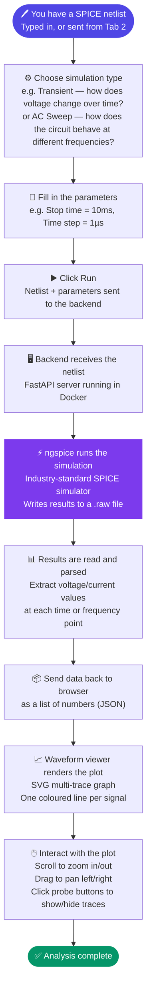
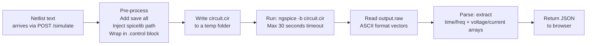

# Tab 3 — SPICE Simulator

Tab 3 connects the browser frontend to a real **ngspice** simulation engine running in a backend server. You configure a simulation, click Run, and see live multi-trace waveforms rendered in the browser. Tab 1 and Tab 2 are entirely self-contained in the browser — Tab 3 is the one part of Weave that requires the backend to be running.

---

## What is ngspice, and why does it run on a server?

**ngspice** is an open-source circuit simulator. It reads a text description of your circuit (a SPICE netlist), solves the underlying differential equations that describe how electricity flows through it, and writes out the results — voltages and currents at every node, at every point in time or frequency.

The reason ngspice runs on a server rather than in the browser is that it is a compiled C program. Browsers can only run JavaScript (and WebAssembly), not arbitrary native programs. So Weave uses a small server — a FastAPI application running in Docker — that accepts your netlist, passes it to ngspice, and sends the results back to the browser.

**What is FastAPI?** FastAPI is a Python library for building web APIs — programs that sit on a server and respond to requests from a browser. Think of it as the receptionist between the browser and ngspice: the browser asks "please simulate this circuit," the receptionist hands it to ngspice, waits for the answer, and hands it back.

**What is Docker?** Docker is a tool that packages a program and all its dependencies into a self-contained box (called a container) that runs identically on any machine. The Weave backend container includes Python, FastAPI, and ngspice pre-installed. You start the whole thing with one command and do not need to install anything else manually.

---

## How Tab 3 Works — Visual Flow



### What happens inside the backend



---

## Architecture

```
Browser (Tab 3)                         Backend (FastAPI + ngspice)
──────────────────────────────          ──────────────────────────────
simulator.ts                            main.py
  └── sim-controls.ts (param form)        └── POST /simulate
  └── waveform-viewer.ts (SVG plot)            └── runner.py
                                                   ├── Write .cir file
                                                   ├── Run ngspice -b
                                                   └── raw_parser.py → JSON
```

---

## Frontend: `simulator.ts`

`initSimulator(root)` builds the Tab 3 layout and wires all events when Tab 3 is first opened.

```
┌─────────────────────────────────────────────────────────────┐
│  Tab 3                                                       │
│  ┌────────────────┐  ┌───────────────────────────────────┐  │
│  │ Sidebar        │  │ Main panel                        │  │
│  │ Netlist area   │  │ Waveform SVG  (zoom + pan)        │  │
│  │ Sim type form  │  │  — or —                           │  │
│  │ ▶ Run          │  │ Table view (numeric output)       │  │
│  │ Backend: ●     │  │                                   │  │
│  └────────────────┘  └───────────────────────────────────┘  │
└─────────────────────────────────────────────────────────────┘
```

### The backend status dot

When Tab 3 loads, it immediately sends a test request to the backend (`GET /ping`). If the backend responds, the dot turns green. If not, the dot turns red.

After that first check, Tab 3 sends a ping every **10 seconds** in the background, keeping the dot up to date. This is why the dot may take a few seconds to turn green after you start Docker — it updates on the next poll cycle, not instantly.

### Receiving the netlist from Tab 2

When you click **Simulate** in Tab 2, it writes the current netlist to a browser storage key and fires a notification. Tab 3 listens for this notification and loads the netlist into its textarea immediately.

Tab 3 also checks for a new netlist every time you switch focus to its tab (every time you click on it). This means even if the notification was missed — for example, if Tab 3 was not yet open when you clicked Simulate — switching to Tab 3 will always pick up the latest netlist automatically.

### Timeouts — two layers of protection

When you click Run, two independent clocks start:

1. **Backend timeout (30 seconds, configurable):** ngspice is given 30 seconds to complete the simulation. If it is still running after 30 seconds, the backend kills the ngspice process and returns an error message. This prevents a runaway simulation from tying up the server indefinitely.

2. **Frontend timeout (35 seconds, fixed):** The browser's network request also has its own independent 35-second limit. If the backend has not responded at all within 35 seconds — not because ngspice timed out, but because the server itself became unresponsive — the browser gives up and shows a timeout error. The 5-second gap between the two timeouts means: in normal circumstances, the backend times out first and sends a clean error message. The frontend timeout is the last line of defence if the server itself hangs.

---

## Simulation Controls: `sim-controls.ts`

The simulation controls form lets you choose a simulation type and fill in its parameters. The form changes depending on which simulation type you select. Here is a plain-English guide to each type.

### `.tran` — Transient Analysis

**What it answers:** How does the voltage (or current) at each point in my circuit change over time?

This is the most intuitive simulation type. You give it a time window and a resolution, and it computes what every voltage and current is doing throughout that window — like recording a video of your circuit in action.

```
Stop time:   [________]   e.g. 10m  (10 milliseconds)
Time step:   [________]   e.g. 1u   (1 microsecond — how often to sample)
```

**Example:** A 555 timer circuit oscillating at 1 kHz. Set stop time to `10m` (10 ms = 10 full cycles) and time step to `1u` (1 µs, fine enough to capture the waveform shape clearly).

Emits: `.tran 1u 10m`

---

### `.ac` — AC Sweep

**What it answers:** How does my circuit respond to signals at different frequencies?

This is used for filters, amplifiers, and anything where frequency matters. Rather than simulating in time, it asks: "if I inject a sine wave at 1 Hz, what comes out? At 10 Hz? At 1 MHz?" It sweeps through a range of frequencies and records the gain and phase shift at each one.

```
Scale:       [dec ▼]      dec (decade) | oct (octave) | lin (linear)
Pts/decade:  [________]   e.g. 100  (100 measurement points per decade of frequency)
Start freq:  [________]   e.g. 1k   (1 kilohertz)
Stop freq:   [________]   e.g. 1Meg (1 megahertz)
```

**What "decade" means:** A decade is a 10× change in frequency. Going from 1 kHz to 10 kHz is one decade. From 10 kHz to 100 kHz is another decade. Choosing `dec` with 100 points per decade gives evenly spaced measurements on a logarithmic scale — this is the standard way to plot frequency responses because it compresses the wide frequency range into a readable chart.

**Example:** Testing a low-pass RC filter. Sweep from 1 kHz to 1 MHz with 100 points per decade. The plot will show the signal passing through at low frequencies and being attenuated at high frequencies, with the cutoff frequency visible as the knee of the curve.

Emits: `.ac dec 100 1k 1Meg`

---

### `.dc` — DC Sweep

**What it answers:** How does my circuit behave as I slowly change one input voltage or current?

Imagine turning a power supply knob from 0V to 5V one step at a time and recording what happens at every step. That is a DC sweep. It is used to find transistor operating points, plot diode I-V curves, and analyse how gain changes with bias.

```
Source:  [________]   e.g. V1      (the source to sweep)
Start:   [________]   e.g. 0       (starting value in volts or amps)
Stop:    [________]   e.g. 5       (ending value)
Step:    [________]   e.g. 0.1     (increment per step)
```

Emits: `.dc V1 0 5 0.1`

---

### `.op` — Operating Point

**What it answers:** What are the DC voltages and currents at every node when the circuit is just sitting still with no input signal?

This is the simplest simulation. No time, no frequency sweep — just "what is the steady state?" It is used to verify that transistors are biased correctly before adding a signal. Results appear as a table of numbers, not a waveform.

No parameters needed. Emits: `.op`

---

### `.noise` — Noise Analysis

**What it answers:** How much electrical noise does my circuit add to the signal, and at what frequencies is it worst?

Every real component — resistors especially — generates a tiny random voltage fluctuation called thermal noise. Noise analysis computes how much of this unavoidable noise appears at the output across a range of frequencies.

```
Output node:  [________]   e.g. V(out)   (where to measure the noise)
Input source: [________]   e.g. V1       (the reference input)
Scale:        [dec ▼]
Pts/decade:   [________]
Start freq:   [________]
Stop freq:    [________]
```

Emits: `.noise V(out) V1 dec 100 1 1Meg`

---

### `.tf` — Transfer Function

**What it answers:** What is the ratio of output to input (the gain), the input resistance, and the output resistance of my circuit at DC?

Transfer function gives you three numbers: the DC gain (how much the output changes per unit of input), the input resistance (what load the circuit presents to its source), and the output resistance (what the circuit looks like to whatever it is driving). Results appear as a table, not a waveform.

**Important:** `.tf` is handled differently from all other simulation types. ngspice writes transfer function results directly to its log output rather than to the `.raw` results file. The backend has a special parser (`_parse_tf_log()`) that extracts these values from the log text. This is why `.tf` results always appear in a table view — there is no time or frequency axis to plot.

```
Output variable: [________]   e.g. V(out)
Input source:    [________]   e.g. V1
```

Emits: `.tf V(out) V1`

---

### `.step` — Parameter Sweep

**What it answers:** How does my circuit behave as I vary a component value — for example, trying five different resistor values in one run?

`.step` runs an inner simulation (transient, AC, or DC) multiple times, changing one parameter each time. The results from all runs appear together on the same waveform plot, one trace per step. Each trace is labelled with a `[1]`, `[2]`, `[3]` suffix to distinguish the runs.

```
Param name:  [________]   e.g. R_val    (the parameter to sweep)
Start:       [________]   e.g. 1k       (first value)
Stop:        [________]   e.g. 10k      (last value)
Increment:   [________]   e.g. 1k       (step size)
Inner sim:   [________]   e.g. .tran 1u 10m  (the simulation to run at each step)
```

**Example:** Sweeping a resistor value from 1 kΩ to 10 kΩ in 1 kΩ steps while running a transient analysis. The waveform viewer will show 10 traces labelled `V(out)[1]` through `V(out)[10]`, one for each resistor value tested.

Emits:
```spice
.step param R_val 1k 10k 1k
.tran 1u 10m
```

---

## Backend: FastAPI (`main.py`)

### Endpoints

| Method | Path | What it does |
|---|---|---|
| `GET` | `/ping` | Health check — returns `{"status": "ok"}` if the server is running |
| `POST` | `/simulate` | Run a simulation; returns waveform data |
| `POST` | `/validate` | Check netlist syntax without running a simulation |

### `/simulate` — running a simulation

**Request body:**
```json
{
  "netlist": ".title RC filter\nV1 in 0 AC 1\nR1 in out 1k\nC1 out 0 1n\n.ac dec 100 1k 1Meg\n.end",
  "sim_type": "ac"
}
```

**Response (transient or DC — real numbers):**
```json
{
  "status": "ok",
  "vectors": {
    "time":   [0.0, 1e-6, 2e-6, ...],
    "V(out)": [0.0, 0.12, 0.23, ...]
  },
  "log": "ngspice stdout/stderr"
}
```

**Response (AC — complex number pairs):**

AC analysis is different from transient or DC. At each frequency, every voltage and current has both a magnitude (how large it is) and a phase (how much it is shifted in time relative to the input). Mathematically these are represented as complex numbers — pairs of two values called the real part and imaginary part.

The backend returns them as `[real, imaginary]` pairs:
```json
{
  "status": "ok",
  "vectors": {
    "frequency": [1000.0, 1023.3, ...],
    "V(out)":    [[0.9998, -0.006], [0.9991, -0.013], ...]
  },
  "log": "..."
}
```

The waveform viewer then computes from these pairs:
- **Magnitude (dB):** `20 × log10(√(real² + imaginary²))` — how much the signal is amplified or attenuated
- **Phase (degrees):** `arctan(imaginary / real)` — how much the signal is shifted in time

Both magnitude and phase plots are available in the AC mode bar that appears above the waveform when an AC result is loaded. Phase is fully supported — it is computed client-side from the complex pairs the backend returns.

**Error response:**
```json
{
  "status": "error",
  "message": "ngspice exited with code 1",
  "log": "Error: no such node 'oout'"
}
```

### `/validate` — checking netlist syntax

This endpoint lets you check whether your netlist is valid SPICE before committing to a full simulation run. It is faster than `/simulate` because it runs ngspice in a mode that parses the circuit and checks for errors, but stops before doing any numerical solving.

**Request body:**
```json
{
  "netlist": ".title My circuit\nV1 in 0 1\nR1 in oout 1k\n.op\n.end"
}
```

**Response (valid netlist):**
```json
{
  "status": "ok",
  "errors": []
}
```

**Response (invalid netlist):**
```json
{
  "status": "error",
  "errors": [
    "Error: no such node 'oout'",
    "Fatal: there aren't any circuits loaded"
  ]
}
```

The backend runs `ngspice -b` on the netlist and scans the output for lines containing the words `error`, `fatal`, or `unknown`. Any matching lines are returned in the `errors` array.

---

## Backend: Runner (`runner.py`)

`run_simulation(netlist, sim_type)` handles the full lifecycle of one simulation run:

1. **Create a temporary folder** under `/tmp/weave_<random-id>/`. This is a fresh, isolated workspace for each run — no leftover files from previous simulations.

2. **Pre-process the netlist** — three transformations run in sequence:
   - `_ensure_control()`: SPICE netlists need a `.control ... .endc` block to tell ngspice to run in batch mode (without waiting for user input). If your netlist does not have one, this adds it automatically. **Batch mode** means ngspice runs, completes, and exits without asking any questions — essential for automated use from a server.
   - `_inject_save_raw()`: Adds the instruction to save all simulation results to a file (`output.raw`). Without this, ngspice computes the results but does not write them anywhere readable. This step handles three different netlist structures (with `.endc`, with `.end`, or with neither) to insert the save instruction in the right place.
   - `_resolve_spicelib()`: If the `NGSPICE_SPICELIB` environment variable points to a directory of component model files, this prepends a `.lib /spicelib/standard.lib` line to the netlist so ngspice can find standard component definitions.

3. **Write `circuit.cir`** to the temp folder.

4. **Run `ngspice -b circuit.cir`** with the configured timeout. The `-b` flag means batch mode — run and exit, no interactive prompts.

5. **Handle the result:**
   - For `.tf` simulations: read the log output and extract the transfer function values using `_parse_tf_log()`. No `.raw` file is produced for `.tf`.
   - For all other simulations: read `output.raw` using `raw_parser.py`.

6. **Clean up** the temp folder.

7. **Return** a `SimResult` object with status, vectors, and log text.

**What happens if ngspice is not installed:**

If ngspice cannot be found at the path specified by `NGSPICE_BIN` (default: `ngspice`), the runner catches a `FileNotFoundError` and returns an error response:
```json
{
  "status": "error",
  "message": "ngspice not found. Is it installed and on your PATH?"
}
```

This typically happens when running without Docker and forgetting to install ngspice locally. The fix is either to start the Docker backend (`docker compose up`) or install ngspice and ensure it is on your system PATH.

**Environment variables:**

| Variable | Default | What it controls |
|---|---|---|
| `NGSPICE_BIN` | `ngspice` | Path to the ngspice executable. Change this if ngspice is installed at a non-standard location. |
| `NGSPICE_TIMEOUT` | `30` | Maximum seconds per simulation before ngspice is killed. |
| `NGSPICE_SPICELIB` | `/spicelib` | Directory of bundled component model files. Set to empty string to disable. |

---

## Backend: Raw Parser (`raw_parser.py`)

### What is a `.raw` file?

When ngspice finishes a simulation, it writes the results to a file with the `.raw` extension. Think of it as a spreadsheet: one column per signal (voltage at node `out`, current through `R1`, etc.) and one row per time or frequency point. The file is in a plain text format (ASCII) rather than a binary format, which makes it straightforward to read with a script.

**A sample `.raw` file for an AC simulation:**
```
Title: RC filter
Date: ...
Plotname: AC Analysis
Flags: complex
No. Variables: 3
No. Points: 200
Variables:
    0 frequency frequency
    1 V(out) voltage
    2 V(in)  voltage
Values:
    0 1.00000e+03 9.99800e-01,-6.28000e-03
    1 1.02329e+03 9.99789e-01,-6.42800e-03
    ...
```

Each data row starts with a point index, then the frequency value, then the voltages. For AC simulations, each voltage is a `real,imaginary` pair (notice the comma — that is how the parser detects complex data).

### Handling `.step` results

When a `.step` parameter sweep runs, ngspice produces multiple separate result sections in the `.raw` file — one section per step. The parser reads all sections and merges them into a single response by adding suffixes to the trace names: `V(out)[1]`, `V(out)[2]`, `V(out)[3]`, and so on. All sections share the same x-axis (time or frequency), so the browser only receives one x-axis array alongside multiple y-axis arrays, one per stepped trace.

---

## Waveform Viewer (`waveform-viewer.ts`)

The `WaveformViewer` class renders simulation results as an SVG multi-trace plot inside the main panel of Tab 3.

### Key methods

```typescript
class WaveformViewer {
  load(vectors: Record<string, number[]>): void  // load data, draw the plot
  clear(): void                                   // wipe the plot area
  render(): void                                  // redraw after zoom/pan
  destroy(): void                                 // clean up event listeners
}
```

**Why `destroy()` matters:**

The waveform viewer attaches event listeners to the browser `window` object — one for mouse wheel scrolling (zoom) and one for mouse drag (pan). These listeners stay active even when the viewer is not visible. When a new simulation result arrives and replaces the current plot, the old viewer instance must call `destroy()` to remove its listeners before the new one is created.

Without this cleanup, each simulation run would pile another set of scroll and drag listeners on top of the existing ones. After three simulations, scrolling the waveform would trigger three separate zoom handlers — the viewer would zoom three times as fast as intended, becoming unusable. `destroy()` prevents this.

### Plot features

- **Multi-trace:** each signal in the results is plotted as a separate coloured line. For `.step` results, each stepped run appears as a separate trace.
- **Probe toggle:** buttons at the top of the plot let you show or hide individual traces. Useful when many signals are plotted and the chart becomes crowded.
- **Zoom:** scroll the mouse wheel to zoom in or out around the cursor position.
- **Pan:** click and drag to move the viewport left and right.
- **Smart tick labels:** axis values are automatically formatted with engineering prefixes — `1k` instead of `1000`, `1M` instead of `1000000`, `1m` instead of `0.001`, `1µ` instead of `0.000001`. This keeps the axis readable regardless of scale.
- **Independent Y scales:** if the result contains signals with very different magnitudes (for example, a voltage measured in volts alongside a current measured in microamps), each trace gets its own Y axis scale so both are visible without one being squashed flat.
- **AC mode bar:** when an AC simulation result is loaded, a mode bar appears above the plot letting you switch between:
  - **Magnitude (dB):** how much the signal is amplified or attenuated at each frequency, expressed in decibels
  - **Phase (°):** how much the signal is shifted in time at each frequency, expressed in degrees

### SVG structure

```
<svg class="waveform-svg">
  <g class="plot-area">
    <g class="grid-lines">...</g>
    <path class="trace trace-0" d="M...L...">
    <path class="trace trace-1" d="M...L...">
  </g>
  <g class="x-axis">...</g>
  <g class="y-axis">...</g>
  <g class="probe-buttons">...</g>
</svg>
```

---

## Docker Setup for Tab 3

Tab 3's backend requires ngspice, which is not available as a browser-side JavaScript package. The recommended way to run it is via Docker:

```bash
docker compose up --build
```

This starts two services:
- **backend** — Python 3.12 + ngspice + FastAPI, available at `http://localhost:8000`
- **frontend** — Node.js + Vite dev server, available at `http://localhost:5173`

After startup, the green dot in Tab 3 confirms the backend is reachable. Allow 10–15 seconds for the backend to fully start before clicking Run.

---

## Running Without Docker

If you have Python and ngspice installed locally:

```bash
# Install Python dependencies
pip install -r backend/requirements.txt

# Start the backend server
uvicorn backend.main:app --host 0.0.0.0 --port 8000 --reload

# In a second terminal, start the frontend
npm run dev
```

Make sure `ngspice` is available on your command line (`ngspice --version` should print a version number). If it is installed at a non-standard path, set `NGSPICE_BIN=/path/to/ngspice` before starting the backend.

---

## Troubleshooting

| Symptom | Likely cause | Fix |
|---|---|---|
| Backend dot is red | Docker not running, or backend still starting | Run `docker compose up`; wait 10–15 seconds |
| Backend dot stays red after Docker starts | Port 8000 in use by another program | Change the port in `docker-compose.yml`: `"8001:8000"` and update `VITE_SIM_BACKEND` |
| `Error: no such node '...'` | Typo in a node name in the netlist | Check node names match exactly — SPICE is case-insensitive but spelling matters |
| Empty waveform after a successful run | ngspice ran but produced no `.raw` output | Check the netlist has a valid simulation directive (`.tran`, `.ac`, etc.) that matches what you selected in the form |
| Timeout error | Simulation took more than 30 seconds | Increase `NGSPICE_TIMEOUT` in `docker-compose.yml`, or reduce the simulation stop time / complexity |
| `connection refused` on Run | Backend URL mismatch | Check `VITE_SIM_BACKEND` in `docker-compose.yml` or your `.env` file matches where the backend is actually running |
| `ngspice not found` error | ngspice not installed or not on PATH | Start Docker (`docker compose up`), or install ngspice locally and verify with `ngspice --version` |
| `.tf` result shows a table instead of a waveform | This is correct behaviour | Transfer function results are scalar values, not time-series data. They always display as a table. |
| `.step` traces all labelled `[1]`, `[2]` etc. | This is correct behaviour | Each suffix identifies one run of the parameter sweep. Use the probe buttons to show/hide individual runs. |
